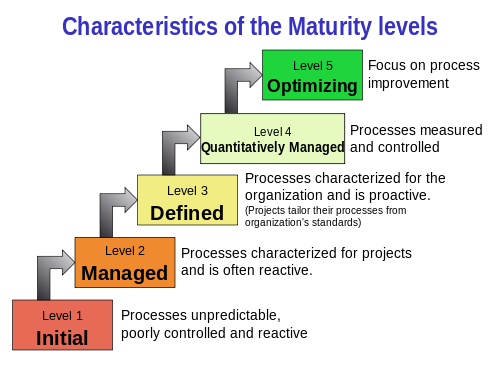

[TOC]
# 他的专业
- Alops

# CMMI
capacity maturity model integration

# 开发阶段
软件开发**工程化**，首先就要**过程化**
分为很多个stages/activities
1. requirement elicitation 需求调研
2. requirement analysis (modeling) 需求分析
3. high level design (modeling) 概要设计建模
4. component (level) design (modeling) 详细设计建模
5. coding
6. testing(unit testing, integration testing, system testing, acception testing)
7. delivery/release
8. support/maintenance

# 两个部分
1. 过程的定义 general process
2. 建模stage2 - 4 将需求从不同角度抽象，便于理解，服务coding
   1. 数据建模
      1. entity relationship diagram & class diagram
      2. 类图在其基础上增加了继承、聚合等
      3. 其实都是描述关系
   2. 功能建模
      1. 时序图在于对象方法的调用，消息的call&return
      2. 状态图描述系统或状态在不同状态之间的转换
   3. 行为建模()

# 软件变更的三种原因
- corrected该BUG
- adapted适应老系统
- enhanced

因而导致maintenance工作量大

因此本课程提供framework
- 过程
- 方法
- 工具

其中很多方法已经工具化
