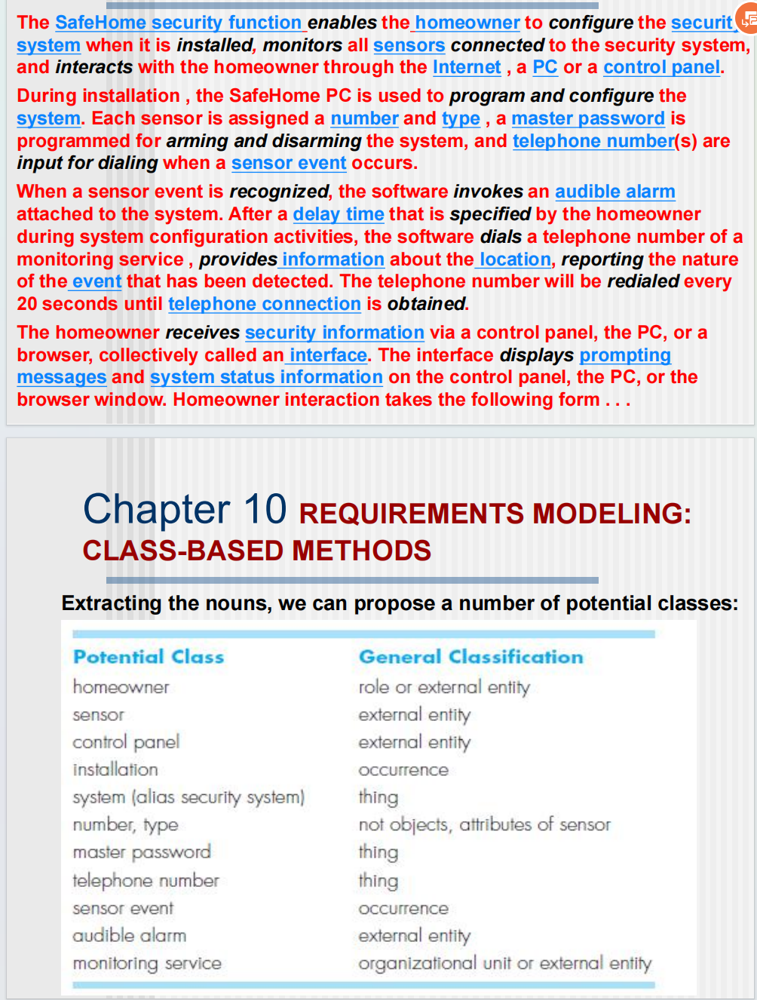
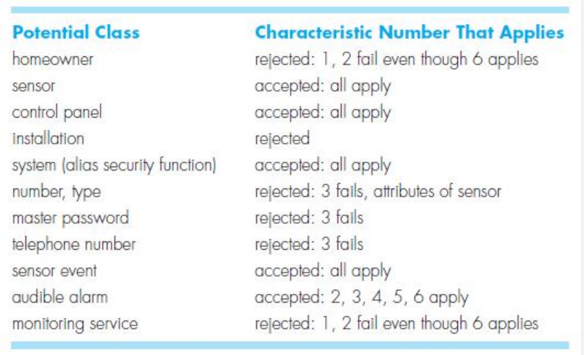
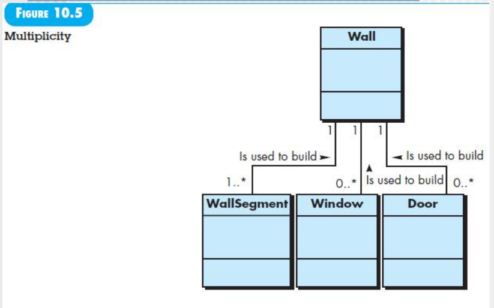
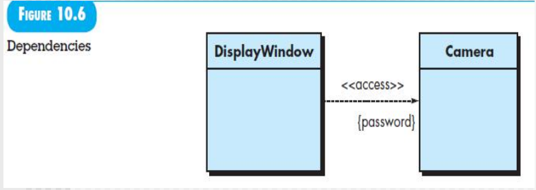
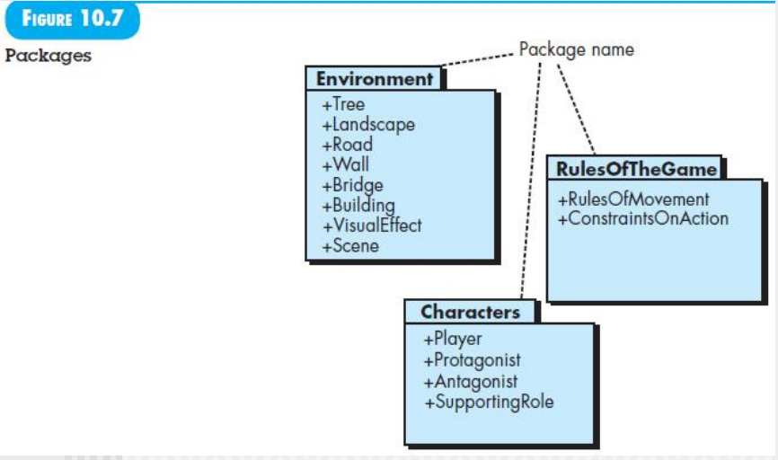

[TOC]
# REQUIREMENTS MODELING:CLASS-BASED METHODS


分析类图要找全，不一定看得见摸得着的，报警声音可能都是一个类

controller 不能放进去，现在还没有技术栈，后面的概要设计才通过 controller 来访问

再重复一遍
- 功能建模 activity diagram
- 数据建模 分析类 class diagram 可以再反过来推出上面的 swimlane diagram
- 行为建模 
  - state diagram 类里面的方法的定义
  - sequence diagram 类之间的协作，一个图对应一个流(正常流、异常流)

都是后台的，没有边界类没有接口类，和技术栈没有关系

## Identifying analysis classes

每个用例找到其中的**名词、名词词组**，都有可能是潜在的分析类

分类是通过将每个名词或名词短语输入到一个简单的表格中确定的。同义词应该被记录下来。如果一个类（名词）是实现解决方案所必需的，那么它是解决方案空间的一部分；否则，如果一个类只是描述解决方案所必需的，那么它是问题空间的一部分。（例如，将物品添加到购物车）

分析类通过以下几种方式表现出来：
- 外部实体（例如，其他系统、设备、人员），它们产生或消耗计算机系统使用的信息。
- 事物（例如，报告、显示器、信函、信号），它们是问题的信息领域的一部分。
- 发生或事件（例如，财产转移或一系列机器人移动的完成），它们发生在系统操作的上下文中。
- 角色（例如，经理、工程师、销售员），由与系统交互的人扮演。
- 在应用程序中相关的组织单位（例如，部门、组、团队）。（例如，项目管理系统的一个小组）
- 确定问题的背景环境和系统的整体功能的位置（例如，制造车间或装车码头）。（例如，SafeHome系统中的传感器位置）
- 定义了一类对象或相关类的结构（例如，传感器、四轮车或计算机）。（例如，控制面板）


看动词是不是实义动词，看是不是归属于哪个类
下划线是名词

由哪**6个特性**帮我找出来是不是分析类**要考**
外部实体可能是，但是支付宝的接口我就不用管了

- **保留的信息**。只有在必须**记住**有关潜在类的信息以使系统正常运行时，该潜在类在分析过程中才会有用。

- 需要的服务。潜在类必须具有一组可识别的**操作**，以某种方式改变其属性的值。例如：`getGrade`

- **多个属性**。在需求分析过程中，重点应放在“重要”信息上；具有单个属性的类实际上在设计过程中可能有用，但在分析活动中最好将其表示为另一个类的属性。

- **公共属性**。可以为潜在类定义一组属性，并且这些属性适用于该类的所有实例。

- **公共操作**。可以为潜在类定义一组操作，并且这些操作适用于该类的所有实例。

- 基本要求。出现在问题空间中并且产生或消耗信息对系统的运行至关重要的**外部实体**几乎总是被定义为需求模型中的类。

注释：
- 在分析模型中考虑哪些类有六个选择特征：1）保留的信息，2）需要的服务，3）多个属性，4）公共属性，5）公共操作，6）基本要求。


1. 上述列表并不包含所有可能的类，为了完成模型，**可能需要添加其他类**；
2. **一些被拒绝的潜在类别可能会成为被接受类别的属性**（例如，"number"和"type"是"Sensor"的属性，"master password"和"telephone number"可能成为"System"的属性）；
3. **不同问题陈述**可能会导致**不同的“接受或拒绝”决策**（例如，如果每个住户有一个独立的密码或通过声纹识别来识别，"Homeowner"类将满足1和2的特征，并被接受）。

弄完了还要评审，不能有模糊的

## Specifying attributes
为了开发一个有意义的分析类的属性集，我们应该研究每个用例并选择那些在合理范围内“属于”该类的“事物”。此外，对于每个类别，还需要回答以下问题：在特定问题的背景下，哪些数据项（组合和/或基本）完全定义了这个类别？

为什么**属性完全定义一次性很难呢**？**有些属性类之间的协作之后才知道要定义**

举个例子，我们考虑SafeHome定义的System类。一个住户可以根据传感器信息、报警响应信息、激活/停用信息、身份识别信息等配置安全功能。我们可以用以下方式表示这些组合数据项：

identification information = system ID + verificationi phone number + system status alarm response information = delay time + telephone number
activation/deactivation information = master password + number of allowable tries + temporary password

这里的所有东西也不一定都会在use case里面都出现

# Defining operations
定义方法

操作定义了对象的行为。虽然存在许多不同类型的操作，但它们通常可分为四个广泛的类别：
- 对数据进行某种方式操作的操作（例如，添加、删除、重新格式化、选择）
- 执行计算的操作
- 查询对象的状态的操作
- 监控对象以控制事件的发生的操作。这些功能是通过对属性和/或关联进行操作来实现的

其实也就两大类
- 协作的
- 内部调用自己的

因此，*操作必须了解类的属性和关联的性质*。作为对分析类推导出一组操作的第一次迭代，可以再次研究**处理叙述（或用例）**并选择合理属于该类的操作。找到**动词**

为了实现这一点，再次对语法分析进行研究并分离出动词。其中一些**动词将是合法的操作**，并可以轻松地与特定类相关联。
例如，在本章之前介绍的SafeHome处理叙述中，我们看到“传感器分配了一个编号和类型”或者“为系统编程了一个主密码用于布防和撤防”。这些短语表明了一些事情：
- 对于Sensor类，assign()操作是相关的。
- 对于System类，program()操作将被应用。
- arm()和disarm()是适用于System类的操作。

经进一步调查，很可能将程序**program()操作分解为若干更具体的子操作**，以配置系统。例如，program()意味着指定电话号码，配置系统特性（例如，创建传感器表，输入报警特性）以及输入密码。但就目前而言，我们将program()指定为一个单独的操作。
除了语法分析外，还可以通过**考虑对象之间的通信**来获得其他操作的更多见解。对象通过传递消息进行通信。

## Class-responsibility-collaborator(CRC) modeling

- **责任是与类相关的属性和方法**。
- 协作者是那些需要为一个类**提供完成某项责任所需信息的类**。通常，协作意味着
  - 要么请求信息
  - 要么请求执行某些动作。

这时候要强调collaboration协作了，可能需要别人提供方法和我协作，我也可以提供方法协作别人

### Classes
**三种，必考给一段话提取出类**

- **实体类entity classes**，也称为模型类或业务类，直接从**问题陈述中提取**（例如，FloorPlan和Sensor）。这些类通常表示需要在数据库中存储并在应用程序的**整个持续时间内持久化的事物**（除非它们被特别删除）。

- **边界类boundary classes(User Interface classes)**，用于创建用户在使用软件时所看到和交互的**界面**（例如，交互屏幕或打印报告）。实体对象包含对用户重要的信息，但它们本身并不显示出来。边界类负责管理以适当的方式将实体对象呈现给用户。**在分析类图中不涉及，但可能在时序图中有**

- **控制类（接口类）controller(interface) classes**从开始到结束管理一个工作单元。也就是说，控制类可以管理以下任务：（1）创建或更新实体对象，（2）实例化边界对象，使其从实体对象中获取信息，（3）实现**对象集之间的复杂通信**，（4）验证对象或用户与应用程序之间传递的数据。一般来说，在**设计活动开始之前不会考虑控制类**。**在分析类图中不涉及，但可能在时序图中有**

### Responsibilities

- 系统智能应该在类之间分布，以最好地满足问题的需求。如果系统智能在应用程序的各个类之间更**均匀地分布**，**每个对象只知道并执行少量的事情（通常是明确的）**，系统的内聚性将得到提高。这增加了软件的可维护性，并减少了由于变更引起的副作用的影响。要判断系统智能是否得到适当的分布，应该评估每个CRC模型索引卡上列出的职责，以确定是否有某个类具有特别长的职责列表。这表明智能集中存在。此外，每个类的职责应该具有相同的抽象层次。

- 每个职责应该尽可能地表述得**更通用**。这条指导原则意味着通用的职责（属性和操作）应该位于类层次结构的较高位置（因为它们是通用的，将**适用于所有的子类**）。

- **相关的信息和其行为应该存在于同一个类中**。这实现了面向对象的封装原则。数据和处理数据的过程应该作为一个**内聚的单元封装**起来。

- 关于**一个事物的信息应该局部化到一个单独的类中，而不是分散到多个类中**。一个类应该负责存储和操作特定类型的信息。一般来说，这个责任不应该在多个类之间共享。如果信息被分散，软件将变得更难以维护和测试。不要冗余。

- **很重要**当适用时，**职责应该在相关的类之间共享**。在许多情况下，**多个相关的对象可能需要同时展示相同的行为，组合、聚合关系的类**。例如，考虑一个需要显示以下类的视频游戏：Player（玩家）、PlayerBody（玩家身体）、PlayerArms（玩家手臂）、PlayerLegs（玩家腿部）、PlayerHead（玩家头部）。每个类都有自己的属性（例如位置、方向、颜色、速度），并且在用户操作操纵杆时都必须更新和显示。因此，更新和显示的职责必须由每个对象共享。
  - 如何区分组合和聚合，在Java里面怎么处理
    - 把腿打没了，这个玩家还能存在，是组合
    - 把腿打没了，这个玩家不能存在了，是聚合
  ```java
  // 聚合
  public class Player {
    private Legs legs;

    public Player() {
        legs = new Legs();
    }

    // 其他方法和属性

    // ...
  }
  // 组合
  public class Team {
    private List<Player> players;

    public Team() {
        players = new ArrayList<>();
    }

    public void addPlayer(Player player) {
        players.add(player);
    }

    // 其他方法和属性

    // ...
  }
  ```

### Collaboration
#### 部分关系is-part-of relationship
- 组合
- 聚合

被组合、聚合的甚至有可能存在依赖关系


#### 关联关系has-knowledge-of relationship
- 单向
- 双向

当一个类需要**从另一个类获取信息**时，就建立了「具有知识」关系。例如，之前提到的「确定传感器状态」的责任就是一个「具有知识」关系的例子

#### 依赖关系，特殊的关联关系depends-upon relationship
「依赖」关系暗示两个类存在一种依赖关系，这种依赖关系不能通过「具有知识」或「部分-整体」来实现。例如，PlayerHead 必须始终连接到 PlayerBody。PlayerHead 对象的一个属性，称为 center-position，是根据 PlayerBody 的中心位置确定的。

### 审查步骤
1. 将参与审查的所有人员分配给 CRC 模型的部分。协作的卡片应该被分开，即每个审查者不应该持有两张协作的卡片。
2. 将所有用例场景（以及相应的用例图）进行组织分类。
3. 审查负责人会有意识地阅读用例。当审查负责人遇到一个命名的对象时，她会将一个符记传递给持有相应类索引卡的人。
4. 当符记被传递时，持有类卡片的人被要求描述卡片上的责任。团队确定是否有一个或多个责任满足了用例的要求。
5. 如果卡片上的责任和协作不能满足用例，就对卡片进行修改。这可能包括定义新的类（和相应的 CRC 索引卡），或者在现有卡片上指定新的或修订后的责任或协作。

## Associations and dependencies
使用 1..* 表示“一个或多个”，使用 0..* 表示“零个或多个”。在 UML 中，星号表示范围的上限是无限的。
在许多情况下，两个分析类之间存在客户端-服务器关系。在这种情况下，客户端类依赖于服务器端类，建立了一种**依赖关系**。





## Analysis packages
就是子系统

分析建模的一个重要部分是分类。也就是说，需求模型的各个元素（例如用例、分析类）按照一定方式进行分类，以形成一个分组，并赋予一个代表性的名称，称为分析包。

分析包用于对类进行分类和分组，以便更好地管理大型系统。例如，在开发视频游戏的分析模型时，会派生出大量的类：

- 一些类专注于游戏环境。
- 另一些类专注于游戏中的角色。
- 还有一些类描述游戏的规则。

都来自use case diagram


## summary
基于类的建模利用从用例和其他应用程序描述中获取的信息来识别分析类。可以使用语法分析从基于文本的叙述中提取候选类、属性和操作。定义类的标准被定义。可以使用一组类-职责-协作指标卡来定义类之间的关系。此外，可以应用各种UML建模符号来定义类之间的层次结构和关系（关联、聚合、继承和依赖）。分析包用于对类进行分类和分组，以便在大型系统中更好地管理它们。


