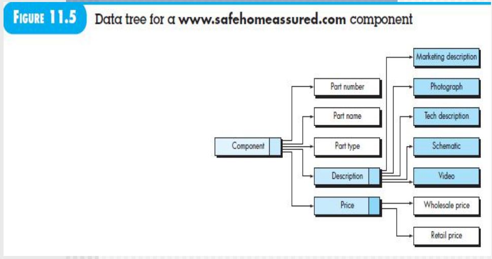

[TOC]
# REQUIREMENTS MODELING:BEHAVIOR, PATTERNS, AND WEB/MOBILE APPS

两个UML
- 状态图
  - 系统级别：帮助整个架构怎么运行的，外部事件驱动
- 类级别：帮助构建方法，通过各种方法处理状态转换(我们这门课主要讲的)
- 时序图
  - C类之间的**协作**依据
  - S**泳道图**相互印证
  - V类图相互**验证**

## create a behavioral model
- 评估所有**用例**以充分了解系统内的交互序列interactive sequence
- 识别驱动交互序列的事件并了解这些事件与特定对象的关系
- 为每个用例创建一个序列
- 为系统(我们不考虑)或类构建状态图
- 回顾行为模型以验证准确性和一致性。

## identifying events with the use case
根据每个use case把事件找出来，应该注意交换的信息，并列出任何条件或约束。一旦所有事件都被识别出来，它们就会被分配给**涉及的对象**。对象可以负责生成事件（例如，Homeowner生成输入密码事件），也可以识别在其他地方发生的事件（例如，ControlPanel识别与密码比较事件相关的二进制结果）。

要根据需求把完整的状态图转化画出来，把所有的**哪个状态能去哪个状态不能去哪个状态都要画出来**

## state representation
考虑两种不同的状态特征
- 每个类在系统执行其功能时的状态，表示了每个类在外部事件的影响下如何改变状态
- 从外部观察系统执行其功能时系统的状态，显示了软件随时间变化的行为。

只是激活系统的一个动态的状态图
还有个自反状态，计时没结束就一致往自己的状态自反转换

状态图中某个状态调用的方法也可能设计多个类的协作，尽量少一些

## patterns for requirements modeling 
pattern 是一种捕捉领域知识的机制，以一种允许在遇到**新问题时重新应用该知识**的方式。在某些情况下，领域知识被应用于同一应用领域内的新问题。在其他情况下，通过模式捕捉的领域知识可以通过类比应用于完全不同的应用领域。在第8章，我们介绍了分析模式的概念，并指出这些模式代表了应用领域中可以在为该领域内的应用进行需求建模时**重复使用**的内容（例如，类、函数、行为）。分析模式被存储在仓库中，以便软件团队的成员可以使用搜索功能找到并重复使用它们。一旦选择了适当的模式，就通过引用模式名称将其整合到需求模型中。

## summary
分析类图 数据建模
活动图/泳道图 功能建模
状态图 行为建模

## REQUIREMENTS MODELING FOR WEB AND MOBILE APPS

前端的

### requirements modeling output
**要考**
#### content model
完成这两个的定义
- 有什么控件
- 有什么界面

每一个content object就是一个控件，即用户可见的实体，在用户通过浏览器或移动设备与应用程序进行交互时创建或操作。

Content objects **can be determined directly from use cases** by examining the scenario description for direct and indirect references to content

这些内容对象可以**存储为单独的文件或从数据库中动态获取**。它们可以直接嵌入到Web页面中，显示在移动设备的屏幕上。换句话说，内容对象是要呈现给最终用户的任何具有内在信息的项目。可以通过直接查看**use case**的场景描述来确定内容对象，其中包含对内容的直接和间接引用。

我Safehome要加一个子系统，什么部件坏了可以去购买
利用**data tree**方法构建前端界面的开发

分层看界面，一个层级一个界面
蓝色的进一步可分解的
A data tree can be created for any content that is composed of multiple **content objects and data items**.

#### interaction model
通过界面的交互完成功能
和下面那个紧密相关

can be composed of ont or more of the following elements
- use cases
- sequence diagrams
- state diagrams
- **user interface prototype**，虽然创建用户界面原型可以说是一个设计活动，但在创建分析模型期间执行此活动是个好主意。越早审查用户界面的物理表示，最终用户得到他们想要的可能性就越高

#### functional model
重点
通过调用后端的方法，来操作 content

- 应用程序向最终用户提供的用户可观察功能
- 实现与类相关行为的分析类中包含的操作

可以用泳道图展示

#### navigation model
破解迷魂阵
指导我怎么利用这个网站的流程

#### configuration model
describes the environment and infrastructure in which the app resides