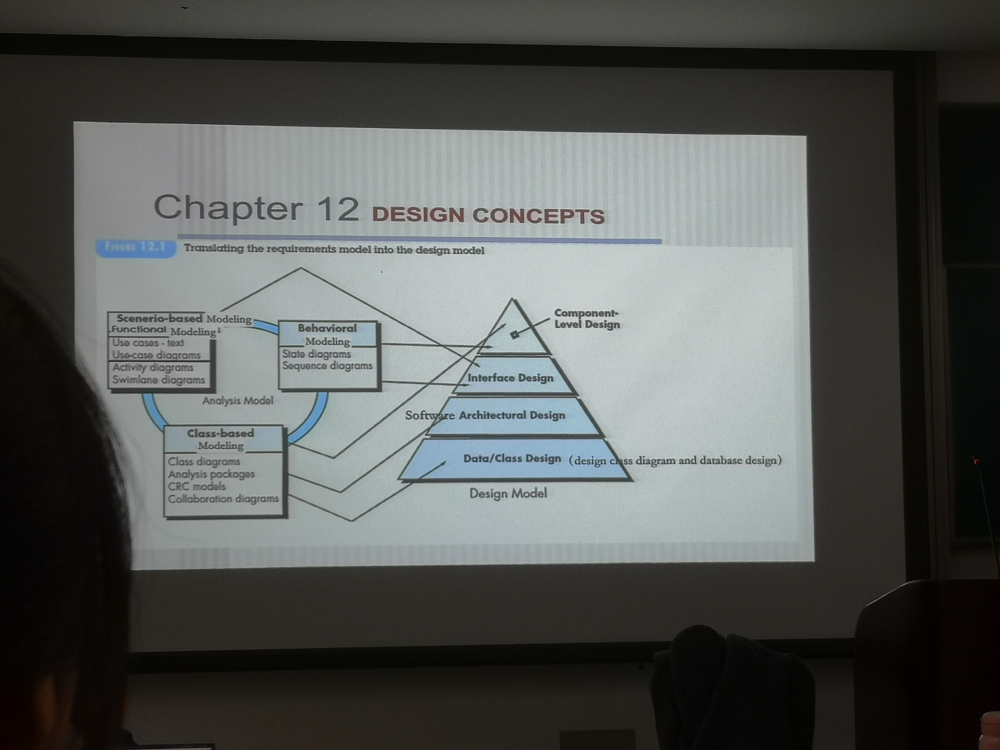
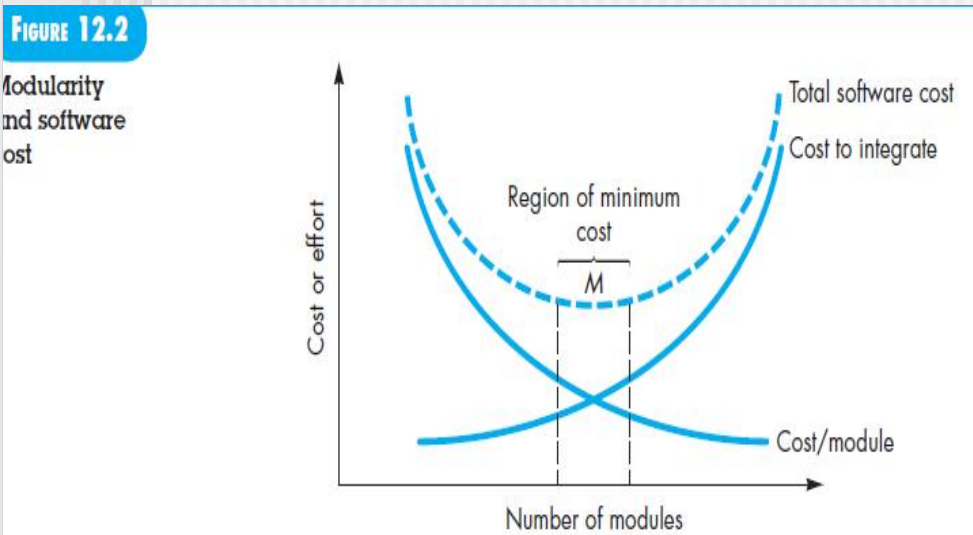

[TOC]
# Design conceptes

设计是为construction activity(coding and test)服务

implement 指 coding

然后评审

## DESIGN WITHIN THE CONTEXT OF SOFTWARE ENGINEERING
设计与分析规约为基础
**要考**

dqf说书上这个有问题
- Data/Class Design: 数据库的设计和分析类图，说改成设计类图
- Architectural Design: 软件的体系结构设计，应该加一个sofrware，黄色的框框
  - 
- Interface Design: 接口设计

分析模型
- Class-based elements 数据库设计和设计类图为依据，和软件架构为依据
  - Class diagram 其他的都是这个的辅助，包含类的属性方法定义和类之间的关系
  - Analysis package 划分了子系统
  - CRC models
  - Collaboration diagram
  - 前端甚至还有data tree
- Behavioral elements 来搞接口定义和设计
  - State diagram 类内方法的调用 这要用到接口
  - Sequence diagram 类之间的 也要用到接口
- Scenerio-based functional elements 也是接口设计的依据，检查是否符合用例中定义的正常流和异常流
  - use cases-text
  - use case diagram
  - activity diagram
  - swimlane diagram
- 详细设计以什么为依据
  - state diagram 进一步确认有没有遗漏 类内的方法
  - sequence diagram 进一步确认有没有遗漏 类之间的方法
  - Class以分析类为基础

**dfq板书**
- Archtectural Design/High level Design 概要设计
  - database design，此前要对分析类图细化变成设计类图(拆分/合并)
  - interface design
    - internal 前后端，子系统之间
    - external 和外部系统的交互
  - software architecture design软件体系结构，包括前后端
- Component level Design(class detailed design) 详细设计

## THE DESIGN PROCESS

随着迭代，不断细化
抽象程度越来越低，代码是最后的抽象

### Software Quality Guidelines and Attributes
#### 如何评估软件设计质量的好坏
在整个设计过程中，不断评估演进设计的质量，通过一系列讨论的技术审查。McGlaughlin提出了三个特征，作为评估良好设计的指南：

1. 设计应该实现需求模型中包含的所有明确的需求，并且必须满足利益相关方所期望的所有隐含需求。**以之前的需求为依据**

2. 设计应该对于那些生成代码、进行测试以及随后支持软件的人员而言，是一份**可读性强、易于理解**的指南。

3. 设计应该从实施的**角度全面呈现diagram of the software**，涵盖数据、功能和行为领域。

#### 如何提高质量，指南

1. 设计应该完成**软件体系结构**
   - 采用可识别的架构风格或模式创建
   - 组件和类为基础
   - 可以以演进的方式实现，从而促进实现和测试

2. 设计应该是**模块化**的，也就是说，软件应该在逻辑上分割成元素或子系统。模块单元：类里面的方法、类、微服务、子系统

3. 设计应该包含对数据、架构、接口和组件的**明确表示**

4、 设计应该应用适用于**要实现的类的数据结构**，并且应该来自可识别的数据模式，影响时空复杂度

5. 设计应该导致表现出**独立功能**特性的组件，高内聚

6. **接口设计尽量简单**

7. 所有的设计都是由**需求和需求分析规约为依据**

8. 设计应该使用**有效传达其含义的符号**表示

#### Quality attribute
软件工程重要的，要考虑它的质量属性
**要考**

- Functionality功能性，是否把需要的功能实现了，是否满足客户的要求
- Usability可用性，界面看不看得懂，别人看了会不会用，设计美学，使用文档提示
- Reliability可靠性，一会成功一会失败，发生故障的频率；结果精度、准确性；MTTF平均失效时间
- Performance性能指标不行：处理速度、响应时间、资源消耗、吞吐量和效率；
  - 出问题了类里面的数据结构问题、数据库索引太多/符号组件太多、类之间接口参数太复杂、软件体系结构设计不好、硬件确实不行
- Supportability可维护性，结合了可扩展性、适应性和可维护性。这三个属性代表了一个更常见的术语，即可维护性，并且另外包括可测试性、兼容性、可配置性。
  - 简单升级一下
  - 例如注释的主谓宾，日志的规范：缩写规定，这样才好维护

并非每个软件质量属性在软件设计过程中都有相同的权重。一个应用程序可能强调具有对安全性的特殊强调的功能性。另一个可能要求性能，特别强调处理速度。第三个可能专注于可靠性。不管权重如何分配，重要的是要注意这些质量属性必须在设计开始时考虑，而不是在设计完成并开始构建后才考虑。

## DESIGN CONCEPTS

### Abstraction抽象
非常非常重要
各种use case/ activity(功能逻辑抽象)/ class(数据角度)/ state(行为角度抽象) diagram是一个抽象，code(implementation abstraction)是最后的抽象，整个都是抽象

在最高层次的抽象中，解决方案以问题环境的语言广泛陈述。
在更低层次的抽象中，提供了对解决方案的更详细描述。问题导向的术语与实现导向的术语相结合，以陈述解决方案。
在最低层次的抽象中，解决方案以可以直接实施的方式陈述。

### Architecture体系结构
软件架构指的是“软件的整体结构以及该结构为系统提供概念完整性的方式”。在其最简单的形式中，架构是程序组件（模块）的结构或组织方式，这些组件之间的交互方式以及组件使用的数据的结构。

一组架构模式使软件工程师能够重用设计级别的概念。

### Pattern
设计模式的目的是提供一种描述，使设计人员能够确定
- 当前工作是否适用于该模式
- 该模式是否可以*重用*，弄成模板（因此节省设计时间），以及该模式是否可以作为开发类似但在功能或结构上有所不同的模式的指南。

### Separation of Concerns
建议任何复杂的问题如果分成可以独立解决或优化的部分，将更容易处理。
*关注点的分离*在其他相关的设计概念中得到体现：模块化、方面、功能独立性和细化。
根据不同粒度区分
任务拆分，复杂度降低$C(p_1 + p_2) > C(p_1) + C(p_2)$

### modularity
模块化，知道一下概念就可以，模块化到什么程度依然没有一个准确的模型

模块少集成成本低，系统容易出问题
所以要找到一个区间平衡在一个范围内，开发成本和集成成本都比较低

### information hiding
信息隐藏和高内聚息息相关
可以封装来达到信息隐藏，以使得模块内部的信息（算法和数据）对于不需要这些信息的其他模块是不可访问的
通过类之间的协作、方法调用

### functional independence
高内聚、低耦合 

关注点分离、模块化、抽象和信息隐藏的概念直接相关的产物

### refinement
精化、细化

在分析类中一个方法和属性特别多，可以拆分
在分析类中一个方法和属性特别少，可以并掉，作为其他类的属性和方法

随着状态图构建完成，再优化类图里面
- 属性的类型、长度、命名规范
- 方法的参数、返回值

后面详细设计，每个函数里面还是要画活动图

### aspects(read by yourself)

### refactoring
**要考**
前面讲了

它是一种重新组织技术，可以简化组件的设计（或代码）而不改变其功能或行为。当软件被重构时，会检查现有的设计，寻找冗余、未使用的设计元素、低效或不必要的算法、构建不良或不合适的数据结构，或者其他可以纠正以获得更好设计的设计失败。

比如，第一个设计迭代可能产生了一个组件，它具有低内聚性（即，执行三个功能，彼此关系有限）。经过仔细考虑，你可能决定将该组件重构为三个单独的组件，每个组件都具有高内聚性。结果将是更易于集成、测试和维护的软件。

### Object-Oriented Designed Concepts

### Design classes
对分析类图进一步细化

五种类型
**要考**
- **业务领域类Business domain classes**：识别分析类定义的业务领域元素所需的属性和服务（方法）。
- **用户界面类**：定义所有人机交互所需的抽象，并经常在隐喻的背景下实现人机交互。
- **过程类**（接口或控制类controller）：实现更低级别的业务抽象，以完全管理业务领域类。
- **持久化类persistent**：代表数据存储（例如数据库），将持续存在软件执行之外。定义类来专门访问数据库，在设计的时候新增的
- **系统类**：实现软件管理和控制功能，使系统能够在其计算环境内运行和与外部世界通信。main函数

此外，Arlow 和 Neustadt 提出了设计类的四个“良好形式”的特征：
1. **完整和充分**：设计类应该是所有属性和方法的完整封装，这些属性和方法可以合理地存在于该类中。里面的属性是否足够支持功能
2. **原始性**：与设计类相关的方法应专注于为类完成一项服务。一旦该服务已经通过某个方法实现，该类就不应提供另一种完成相同任务的方法。学号在学生类里面，其他类就不能有了
3. **高内聚**：内聚性强的设计类具有小而集中的一组责任，并专注于应用*属性和方法*来实现这些*责任*。
4. **低耦合**：在设计模型中，设计类需要相互合作。
   1. 合作应保持在可接受的最低限度。
   2. 子系统内的设计类对其他类的了解应该是有限的。这种限制被称为迪米特法则，它建议方法只发送消息给邻近的类中的方法。
   3. 多个类之间都有相互调用就不是低耦合
   4. 尽量功能相近的类协作，如果一个子系统里面多个类都要访问另一个子系统里面的一个类，那就要考虑把这个类移动子系统
   5. 低耦合体现在哪几个方面**要考**
      1. 参数方面：协作的参数少、参数值简单
      2. 协作方面：类内之间方法的访问可以频繁，每个类之间的访问要少、子系统之间要更少