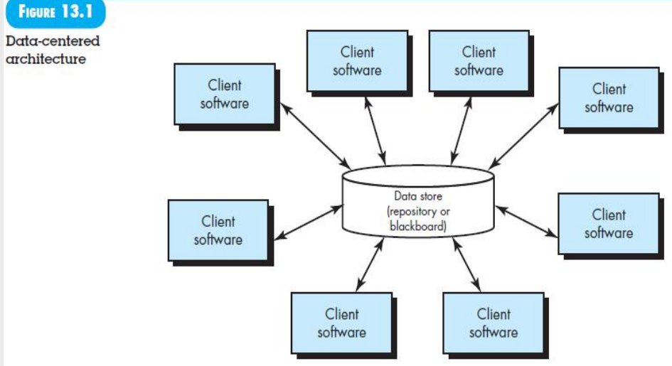
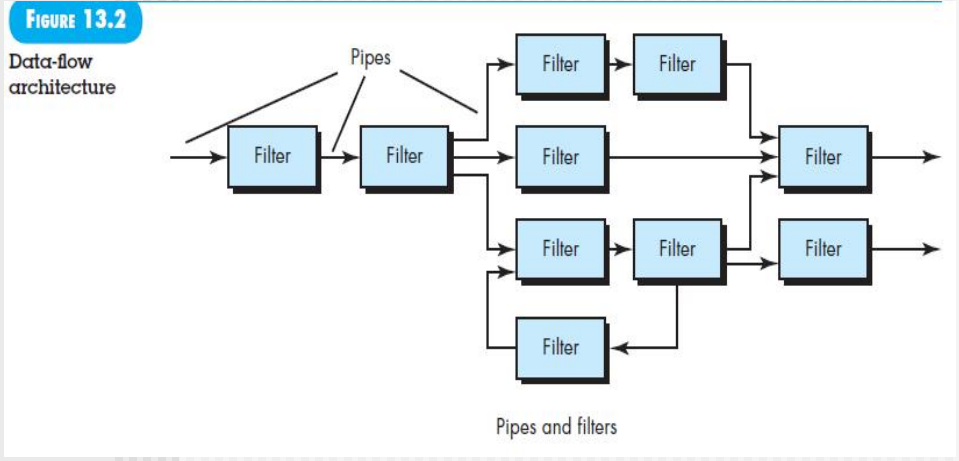
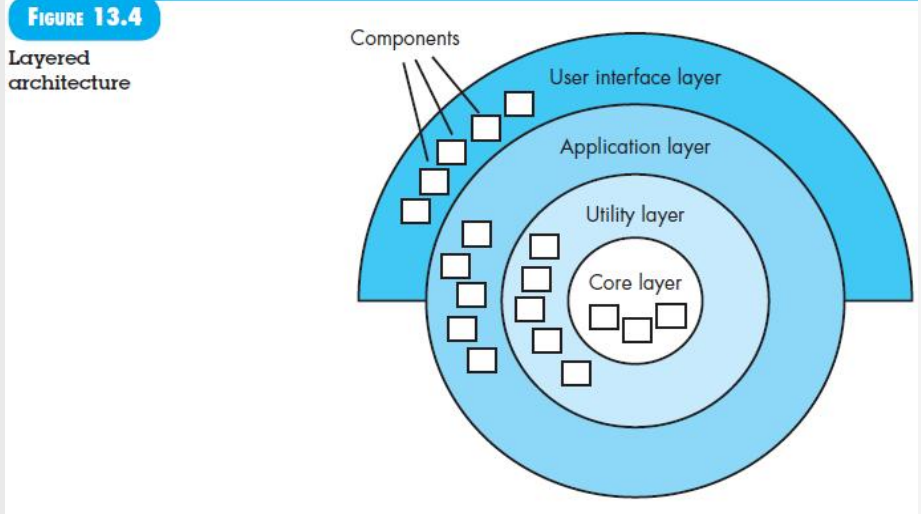
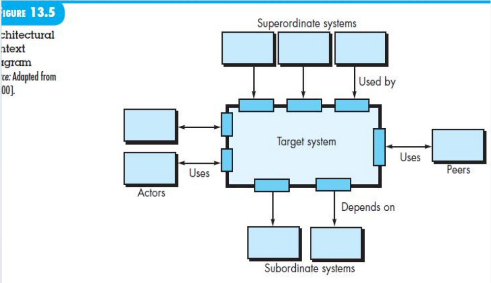
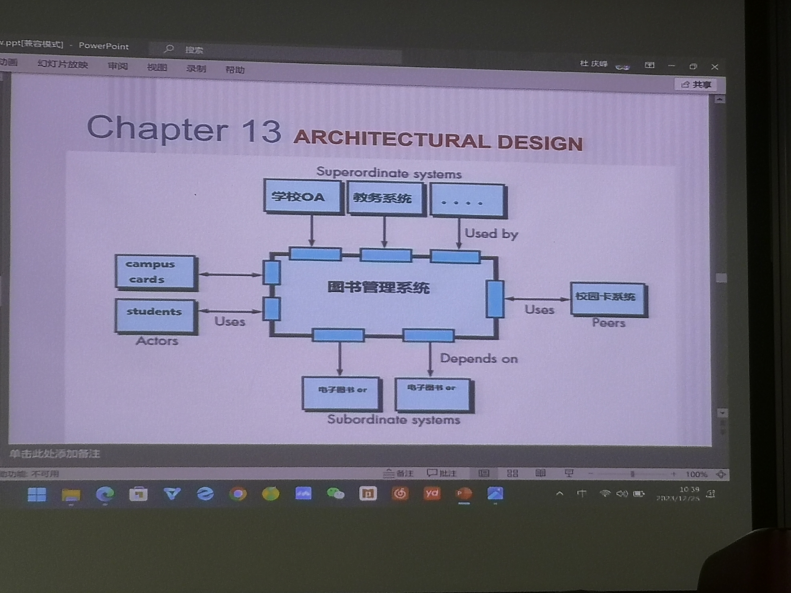

[TOC]
# Architecture Design

Architecture design begins with data model(类图)，设计前期从分析类图到设计类图，设计类图里面根据用例图划分子系统，然后子系统之间访问定义接口类

软件体系结构风格还不同，通过评审找出哪一个最好

component不仅仅是类，还有

## software architecture

### what is architecture
是一种抽象表示
- 分析设计在满足规定要求方面的有效性
- 在进行设计更改相对容易时考虑架构替代方案
- 降低与软件构建相关的风险。

软件组件可以是
- 简单的程序模块或面向对象的类，
- 扩展到包括数据库和“中间件”，这些能够配置客户端和服务器网络。

在架构层面，内部属性（例如算法的细节）不被指定。

组件之间的关系可以是一个模块对另一个模块的过程调用，也可以是复杂的数据库访问协议。

### why important
- 提供了一个表示，有助于各利益相关者之间的沟通
- 实现代码的依据
- 构成了一个相对简洁、可以理解的模型，展现了系统的结构以及组件如何协同工作

### architecture description
不同的利益相关者会从不同的视角看待架构，这些视角受到不同关注点的驱动。架构描述需要简洁易懂，因为它构成了谈判的基础，特别是在确定系统边界时。

开发人员希望在设计方面得到明确的指导。客户希望清楚地了解必须发生的环境变化，并确保架构能够满足他们的业务需求。其他架构师希望清晰地理解架构的关键方面。

### architecture decisions
架构描述的每个视图都针对特定的利益相关者关注点。为了开发每个视图（以及整体的架构描述），系统架构师会考虑多种替代方案，并最终决定最适合满足关注点的具体架构特性。作为系统架构师，你可以使用边栏中建议的模板来记录每个重要决策。通过这样做，你为自己的工作提供了合理性，并建立了一份历史记录，在必须进行设计修改时可能会有用。如果不记录工作的成功和失败，软件工程师很难确定何时创新，何时使用先前创建的架构。

## GÉNEROS ARQUITECTÓNICOS

业务角度：很多流派

## Architectural Style

技术角度：很多风格

每种风格描述了一个系统类别
- 执行系统所需功能的一组组件（例如数据库、计算模块
- 使组件之间“通信、协调和合作”的一组连接器
- 定义组件如何集成形成系统的约束
- 语义模型，通过分析组成部分的已知属性，使设计者能够理解系统的整体属性

### A Brief Taxonomy of Architectural Styles

- 数据中心架构data center：该架构的核心是数据存储（例如文件或数据库），其他组件经常访问该存储，并对其中的数据进行更新、添加、删除或修改。数据中心架构促进了可集成性。
  - 

- 数据流架构data flow：当输入数据需要通过一系列计算或操作组件转换为输出数据时应用此架构。管道和过滤器模式有一组组件（称为过滤器），通过管道将数据从一个组件传输到下一个。每个过滤器独立工作。若数据流退化为一条转换线，则被称为*批处理*顺序。
  - 
  - 银行批处理就是数据流架构，产生各种各样的数据报表

- 调用和返回架构call and return：这种架构风格使得程序结构相对易于修改和扩展。例如：主程序/子程序架构。
  - C语言的

- 面向对象架构object-oriented：系统的组件封装了数据和必须应用于操作数据的操作。组件之间通过消息传递进行通信和协调。
  - 现在常用的
  - 也是不断演化C/S->B/S->前后端分离->微服务架构(越来越工具化、越来越方便，保证软件的质量)

- 分层架构：定义了许多不同的层，每一层执行的操作逐渐接近机器指令集。外层组件服务用户界面操作，内层组件执行操作系统接口。中间层提供实用服务和应用软件功能。 对模型-视图-控制器（MVC）架构进行分析。
  - 
  - 综合的，复杂的可能每一层都负责有不同架构不同语言，银行系统

**要考**软件体系架构和系统体系架构
软件体系架构**不断演化**，前后端不分->...->微服务

### Architecture Patterns
成功的经验具体化，变成模板

### Organization and Refinement
我们通过设计得到软件体系架构

不断变化、演化和完善

那个图为什么把报表画在外面，大的蓝色开发完了，现在我们最后一次迭代开发报表，报表子系统放在原来后端的软件体系结构里面去，和原来的怎么交互，把小的蓝框和大的蓝框融合起来就是演化的结果

## Architectural Design
需要建立上下文
需要描述与软件进行交互的外部实体（例如其他系统、设备、人员）及其交互性质。这些信息通常可以从需求建模中获取。

### Representing the System in Context
**要考**ACD architectural context diagram

整个运行的环境搞清楚，才能形成系统的体系结构，完成ACD之后还有描述
- 上游系统superordinate system：谁来调用used by
- 下游系统subordinate system：调用谁depends on
- 平级系统peer-level：相互调用
- Actors：uses

**要考**这么多年总结出来的
目标**软件体系结构设计**步骤
- 分析类图
- 设计类图
  - 属性进一步完善
  - 方法的定义
    - 用例图的动词
    - 状态图
  - 合并拆分类
- 设计类图的细化(控制类、访问数据库的类...)
- 基于这样的设计构建子系统，依据 use case diagrams，和上面一个紧密相关
- 完成目标软件体系结构，前后端放进去

设计
- 软件体系结构设计，上面说了
- 数据库设计
  - 一对多、多对多
  - 以没有控制类的分析类图为依据
  - 关系属性不要漏了
- 接口设计
  - 内部接口：目标软件体系结构中，所有内部需要协作的接口，依据时序图，包括
    - 子系统类内的方法调用，尽量多
    - 子系统类之间的方法调用，少一些
    - 子系统之间通过controller访问，尽量少
    - 前后端之间
  - 外部接口：和其他系统的交互
    - 别人设计好了告诉我们
    - 我告诉别人接口怎么样