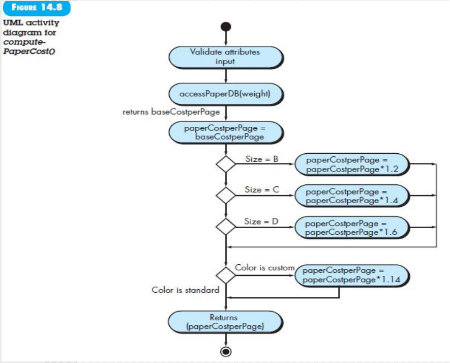

[TOC]
# Component-level design
定义了分配给每个软件组件的**数据结构，算法，接口特性和通信机制**
然后进行评审，检查设计以确定数据结构、接口、处理序列和逻辑条件是否正确

详细设计 两个主要任务

共用的访问数据库的类多重要、边界类、控制类这些辅助

- 完整的方法和属性的基础上，完善和定义协作的方法，告诉别人怎么调用和我要怎么调用别人，(不但内部，还要告诉别人)，不仅仅是自己，要考虑协作关系的
  - 定义就是**定义参数**

- 每个类都要构建对应的 activity diagrams，*每个方法都要*

传统的，针对函数

## steps
你必须将需求requirements和架构模型architectural model的信息转化为设计表示，以提供足够的细节来指导构建（coding和testing）活动
1. identify all design classes that correspond to the **problem domain**关注业务类的功能，根据分析类完善业务类的设计
2. identify all design classes that correspond to the **infrastructure domain**关注GUI、系统的信息、TCP等等这些 utils的类
   1. 只有方法没有组件的类——接口类
   2. 只有属性没有方法的类——全局变量初始化类
   3. 与业务无关的类——界面类
3. elaborate all **design classes** that are not acquired as reusable components 这里不考虑 refactor，高内聚低耦合
   1. 这个类和哪几个类有协作，指定消息的详细信息
   2. 类内方法接口调用
   3. 定义的属性，数据类型和返回结果，需要的而数据结构
   4. 每个方法活动图或者伪代码
    
4. Describe **persistent data sources** (databases and files) and identify the classes required to manage them 要保存的信息
5. Develop and elaborate behavioral representations for a class or component 状态图和时序图进一步细化确认，看有没有遗漏，是否合理
6. 部署图，提供额外的实现细节，基于架构图
7. 对每个类的代码进行重构**要考**refactor，可读性、复用性、合理性、前面有一个ppt

## summary
概要设计以需求规约( case case 图)、需求分析规约(功能建模、数据建模、行为建模)为依据

详细设计对每个类进行设计，需求规约、需求分析规约、概要设计规约为依据(**行为建模、类建模**)，考虑多个类之间的协作
- 业务类的细化
- 只有属性没有方法的类的定义
- 只有方法没有属性的类的定义

不同子系统不同 package，前后端分离的接口定义

微服务可以独立部署、单独测试、独立使用(一个坏了不影响其他的工作)、不同的组件可以构成一个微服务