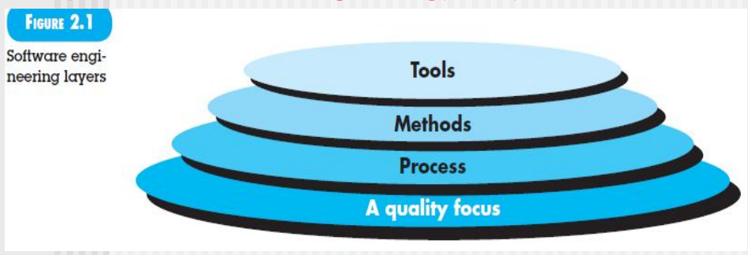

[TOC]
# Chapter2 Software Engineering
## DEFINING
- The application of a systematic, disciplined, quantifiable, approach to the development operation, and maintenance of software
  - **systematic**: 软件开发的**过程化**，过程里面要**系统化**
  - **disciplined**: 开发过程中要遵守的一系列规则的**约束**，用什么test，用什么配置管理...
  - **quantifiable**
    - **Software Review**(评审) is systematic inspection of a software by one or more individuals who work together to **find and resolve errors and defects** in the software during the **early stages** of Software Development Life Cycle (SDLC). 
    - 对软件开发过程中的各种衡量依据，定量化分析判断开发过程的好坏，然后进一步改进。例如每页的缺陷率不超过XX%
    - 非常非常重要
- the **study of approaches** as in above

把软件工程**抽象为不同的layers**，layered technology

- 底部，**核心目的: 提高质量**，quality focus
- Process，过程化
- Methods，过程中会使用各种各样的方法，例如UML
- Tools，GIT、IDE、Maven...
  - 发展趋势 -> 工具集成Tool integration
  - Software engineering tools provide automated or semi-automated support for the process and the methods.When tools are integrated so that information created by one tool can be used by another, a system for the support of software development, called **computer-aided software engineering(CASE)**, is established.
  - 开发的过程中用到的所有工具统称为CASE

## THE SOFTWARE ENGINEERING
activities/stages, actions & tasks的集合

系统化的包含关系
- activity1/stage1
  - action1
  - action2
    - task1
    - task2
    - task3
    - ...
  - action3
  - ...

**例如**
- activity: code
  - action1: check detailed design
    - task1: 检查详细的设计规约完整性
    - task2: 检查详细设计规约是否依据概要设计来的
    - task3: 检查每个类设计的流程图
  - action2: interface definition(接口定义)
  - action3: code action
  - action4: code review action
    - task1: 准备工作，人员有谁，谁负责
    - task2: 预评审阶段，发代码给别人先看
    - task3: 举行评审会
    - task4：修改代码

每一次迭代都是一个过程，故有迭代开发DevOps
## Process Framework
过程框架的两种活动
- development dimension上面的就是framework activity，开发的活动，开发维
- quality dimension，umbrella activity, management activity，质量维，庇护性活动，管理维

generic process framwork
- Communication
- Planning(umbrella activities)
- Modeling
- Construction
- Deployment

## Umbrella Activities
通过**管理**进而提高软件开发过程中的*工作产品*质量

软件质量就是在开发过程中形成的

工作产品
- 各种规约
- 代码
- ...

**典型的management activities**
- 项目管理
  - planning
  - tracking
  - control
- risk management风险管理
  - identify识别风险
    - **方法**
      - 根据以往经验experience
      - 头脑风暴brainstorming
      - 专家库repository
    - risk exposure = probability(0-1) * lse(0-10)，从而总结出top5/top10
  - risk mitigation/avoiding plan缓解/规避风险
  - 跟踪风险
    - 每个activity做完都去持续更新top5/top10，总结原因
- SQA(software quality assurance)
  - 还是个职位
  - 在*进行中*检查别人的工作产品是否符合要求
    - 代码符合规约？
    - 规约表述模糊？
- technical review
  - 工作产品做完后进行
  - 比较正式
- measurement
  - 通过测量，得到定量化的指标，从而保证SE中定义中的quantifiable
  - measure测量得到原始数据：全校学生身高
  - metric度量得到处理后的数据：平均数、方差...
- software configuration management
  - 配置项configuration item，最小的独立单元
  - check in/out 程序
    - 版本管理
    - 版本分支
    - 项目发布
      - 打tag，把多个项目特定版本关联起来
- reusability management
  - 主打一个可复用
  - 例子
    - 类库
    - 分支开发
      - 直辖市版本
      - 省版本

## Process Adaptaion
在实际开发中，之间的process的提出只是general的，要根据实际情况进行**调整**
这段文本主要讨论了评估软件开发过程框架的几个方面，包括：

1. 行动和任务在框架活动中的定义程度；
2. 工作产品的识别和要求程度；
3. 质量保证活动的应用方式；
4. 项目跟踪和控制活动的应用方式；
5. 描述过程的详细程度和严谨程度；
6. 客户和其他利益相关者参与项目的程度；
7. 软件团队获得的自主权程度；
8. 团队组织和角色的规定程度。

## software engineering practice
1. 理解问题(交流、计划、分析建模)
2. Plan a solution(设计建模--分析建模的细化) -- 架构
3. Carry out the plan(code generation)
4. Examine the result for accuracy(testing and quality assurance)
一开始是分析类图，然后才到设计类图，数据库表根据设计类图设计

### General Principles
- The First Principle: The Reason it All Exists（存在价值，解决什么问题）
- The Second Principle: KISS(Keep It Simple, Stupid)
- The Third Principle: Maintain the Vision
- The Fourth Principle: What You Produce, Others Will Comsume（要清楚需求，有人用才行，人家也不关心你技术好不好，重点是可用）
- The Fifth Principle: Be Open to the Future
- The Sixth Principle: Plan Ahead for Reuse
- The Seventh Principle: Think

## SOFTWARE DEVELOPMENT MYTHS
之前的误解，但现在已经落伍陈旧，会误导现在的开发
Myth（迷思）：
**management myths**
1. 我们已经有一本关于软件构建标准和流程的书籍，这不是我们的员工所需要的全部知识吗？
2. 如果我们进度落后，我们可以增加更多的程序员来迎头赶上。
3. 如果我决定将软件项目外包(outsource)给第三方，我可以轻松放松，让那个公司来构建它。
**customer myths**
4. 一般的目标陈述足以开始编写程序，细节可以以后填写。
5. 软件需求不断变化，但是软件的灵活性可以轻松应对。
**practioner's myths**
6. 一旦我们编写并使程序运行，我们的工作就完成了。
7. 直到程序正常运行之前，我没有办法评估其质量。
8. 项目成功的唯一可交付工作成果是可工作的程序。
9. 软件工程会使我们创建冗长而不必要的文档，并且必然会减慢我们的速度。

Reality（现实）：
**management myths**
1. 一本关于软件构建标准和流程的书籍可能存在，但并不代表它被使用、被软件从业者知晓、反映现代软件工程实践、完整且可适应。
2. 软件开发不同于制造业的机械过程，加入更多程序员并不能解决进度落后的问题。布鲁克斯指出，“在一个延迟的软件项目中增加人员只会使项目更加延迟。”同时，添加新成员还需要将原有成员花费时间教育新人。
3. 如果组织不懂得如何在内部管理和控制软件项目，那么将软件项目外包给第三方也会面临困难。
**customer myths**
4. 虽然一个全面稳定的需求陈述并不总是可能的，但一个含糊不清的“目标陈述”是灾难的原因。明确的需求通常通过客户和开发人员之间的有效和持续的沟通来逐步发展。
5. 虽然软件需求确实会不断变化，但变化的影响取决于引入变化的时间。早期提出的变化请求（在设计或代码开始之前）对成本的影响相对较小，随着时间的推移，成本影响会迅速增加。 
**practioner's myths**
6. 一位人说过：“你开始‘写代码’的时间越早，完成的时间就会越长。”根据行业数据，60%到80%的软件开发工作将在首次交付给客户之后进行。
7. 从项目开始阶段就可以应用一种有效的软件质量保证机制——技术审查。软件审查比测试更有效，能够发现特定类别的软件缺陷。
8. 一个可工作的程序只是软件配置的一部分，软件配置还包括许多元素。各种工作产品（如模型、文档、计划）为成功的工程提供基础，更重要的是为软件支持提供指导。
9. 软件工程并不是关于创建文档，而是关于创建高质量的产品。更好的质量可以减少重复工作，减少重复工作可以缩短交付时间。
