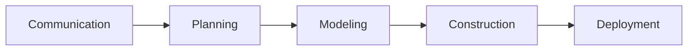
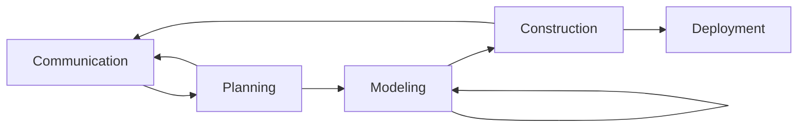
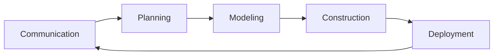
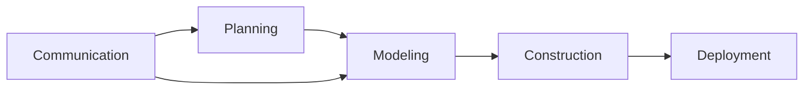

# THE SOFTWARE PROCESS
## A Generic Process Model
基于很多Process flow
### Linear process flow

不实际
### iterative process flow

### Evolutionary process flow

### Parallel process flow

## Defining a Fraework Activity
小项目简化、减少action

## Identifying a Task Set
应该选择最适合项目需求和团队特点的任务集。这意味着软件工程可以根据软件项目的具体需求和项目团队的特点进行适应和调整

task是软件工程最小的工作单元了
## Process Patterns
## Process Assessment and Improvement
## Summary