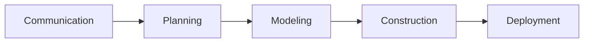
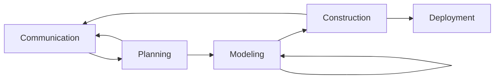
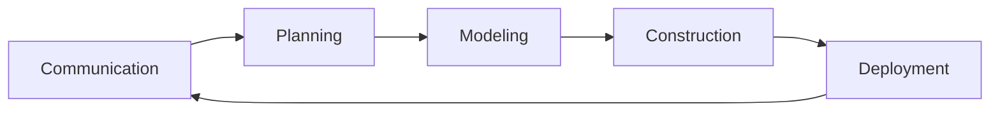
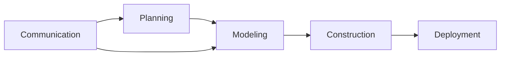
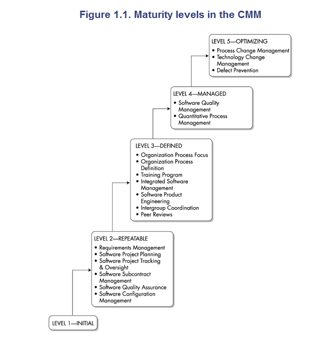

[TOC]
# THE SOFTWARE PROCESS
## A Generic Process Model
基于很多Process flow
### Linear process flow

不实际
### iterative process flow

### Evolutionary process flow

不管有多少问题，本次迭代完再说，要出一个可展示的产品
### Parallel process flow

## Defining a Fraework Activity
小项目简化、减少action
一个action一个task都行

## Identifying a Task Set
- work tasks
- work products
- quality assurance points
- project milestones

应该选择最适合项目需求和团队特点的任务集。这意味着软件工程可以根据软件项目的具体需求和项目团队的特点进行**适应和调整**

小项目
- Make a list of stakeholders for the project
- Invite all stakeholders to a informal meeting
- Ask each stakeholders to make a list of features and functions required
- Discuss requirements and build a final list
- Prioritize requirements
- Note areas of uncertainty

大项目
- Make a list of stakeholders for the project
- Interview each stakeholder separately to determine overall wants and needs
- Build a preliminary list of functions and features based on stakeholders input
- Schedule a series of facilitated application specification meetins
- Conduct meetings
- Produce informal user scenarios as part of each meeting
- Refine user scenarios based on stakeholder feedback
- Build a revised list of stakeholder requirements
- Use quality function deployment techiniques to prioritize requirements
- Package requirements so that they can be delivered incrementally
- Note constraints and restrictions that will be placed on the system
- Discuss methods for validating the system
1. 制定利益相关者清单：确定项目中涉及的利益相关者，包括项目发起人、客户、最终用户、开发团队等。

2. 与每个利益相关者进行单独面谈：与每个利益相关者进行个别面谈，了解他们的整体需求和期望。

3. 基于利益相关者的反馈建立初步的功能和特性清单：根据利益相关者的意见和反馈，建立初步的功能和特性清单。

4. 安排一系列应用规范会议：安排一系列应用规范会议，由相关利益相关者参与，以深入讨论和明确应用规范。

5. 进行会议：组织会议，与利益相关者一起讨论项目需求、功能和特性，并达成共识。

6. 作为每个会议的一部分，制定非正式用户场景：在每个会议中，根据讨论的结果和利益相关者的反馈，制定非正式用户场景。

7. 根据利益相关者的反馈完善用户场景：根据利益相关者的意见和反馈，调整和完善用户场景。

8. 建立修订后的利益相关者需求清单：根据用户场景和利益相关者的反馈，建立修订后的利益相关者需求清单。

9. 使用质量功能展开技术对需求进行优先级排序：采用质量功能展开技术，对需求进行优先级排序，以确定开发的重点和优先顺序。

10. 分阶段交付需求：将需求进行打包，使其能够逐步交付和实施。

11. 注明系统的约束和限制：记录系统可能面临的约束和限制，例如时间、资源、技术等方面的限制。

12. 讨论系统验证的方法：与利益相关者一起讨论并确定系统验证的方法，确保系统符合规范和要求。

task是软件工程最小的工作单元了

MS-project管理工具
## Process Patterns
经验的总结，形成的模板(pattern)，告诉你**怎么做**，提高软件质量
但是这些pattern属于公司的过程财富，还不公开
[LLM大模型](https://www.techopedia.com/5-ways-llms-can-empower-software-engineering)

- Pattern name 例如TechnicalReviews一个有意义的名字
- Forces: The environment in which the pattern is encountered
- Type
  - Stage pattern
  - Task pattern书上就把action和task合并起来，实际也可以有action pattern
  - phase pattern过程相关的，告诉你用什么过程模型
- initial Context 执行这个pattern之前的前置工作要做什么，检查是否满足
  - 相关前期活动
  - process的初始状态
  - 已经存在的项目信息
  - 比如coding要检查详细设计，前提是详细设计**要有、评审、修改...**
- Problem: The specific problem to be solved by the patterns
- Solution: Describes how to implement the pattern successfully
- Resulting Context: pattern做完之后
  - 有哪些团队的相关工作的activities must have occured
  - exit state for the process
  - 通过一些工具传递做完的信息
- Related Patterns: follow一个pattern，其中又遇到一个不懂的，找到了另外一个pattern。嵌套的pattern
- Known Uses and Examples

Project closure is the critical last phase in the project management lifecycle. During project closure, the team **reviews** the deliverables, then compares and tests its quality to the intended project outcome. Then they share the deliverables with the project’s client.
Project closure的时候就可以总结/更新pattern了

## Process Assessment and Improvement
过程模型(process model)都不是一尘不变的，需要评估和改进
软件工程强调持续改进

三种approaches 
CMMI和CMM比较通用

**要考的**
- Standard CMMI Assessment Method for Process Improvement(SCAMPI)
  - capacity maturity model integration
  - 
  - 级别越高，软件工程能力越高，开发过程越规范
  - 有**评估师**
  - 利用kpa衡量，每个level满足相应的一些kpa
  - 每个级别
    - initial level: 想怎么做怎么做
    - repeatable: 
- CMM-Based Appraisal for Internal Process Improvement (CBAIPI)
  - CMU的研究所把很多大型软件研究开发方法过程，给出过程方法框架
- SPICE (ISO/IEC15504)
  - 一开始是化工行业，之后才是软件开发(下面那个)
- ISO 9001:2000 for Software

CMM以及CMMI未完待续...
## Summary