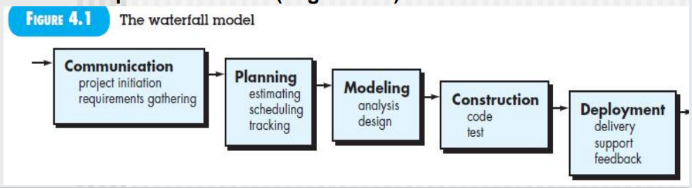
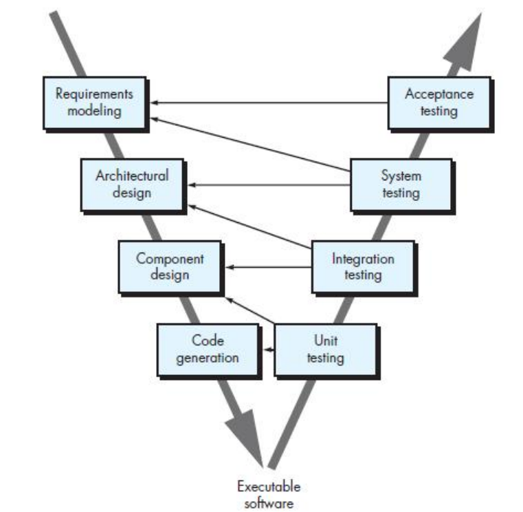
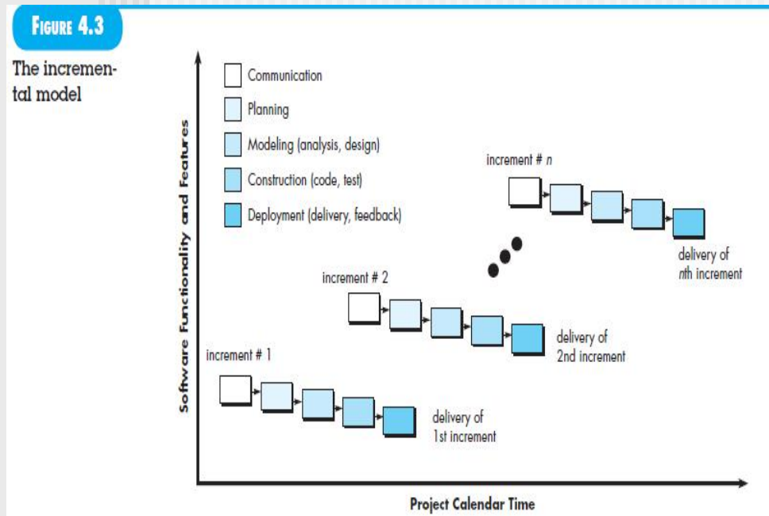
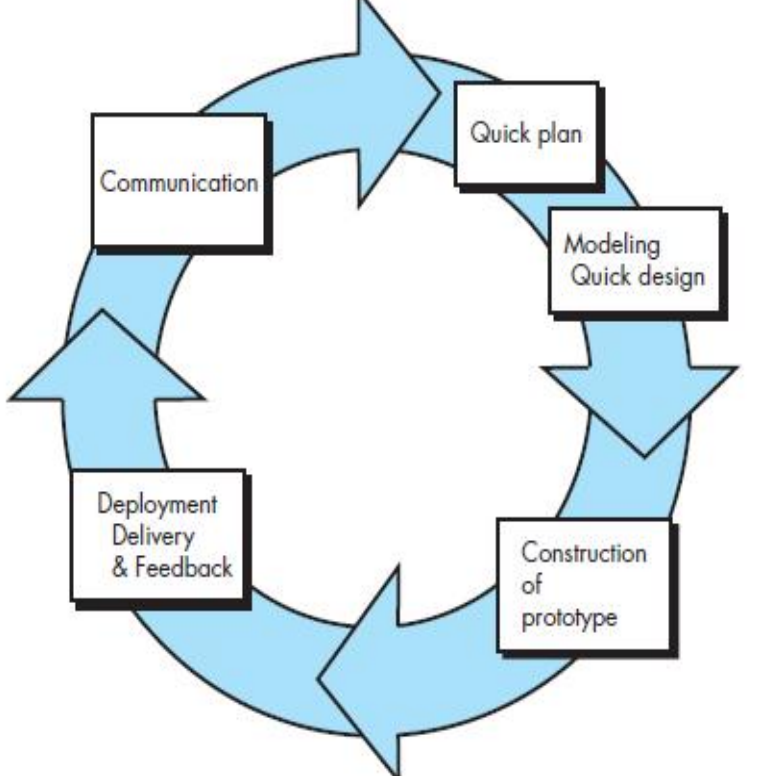
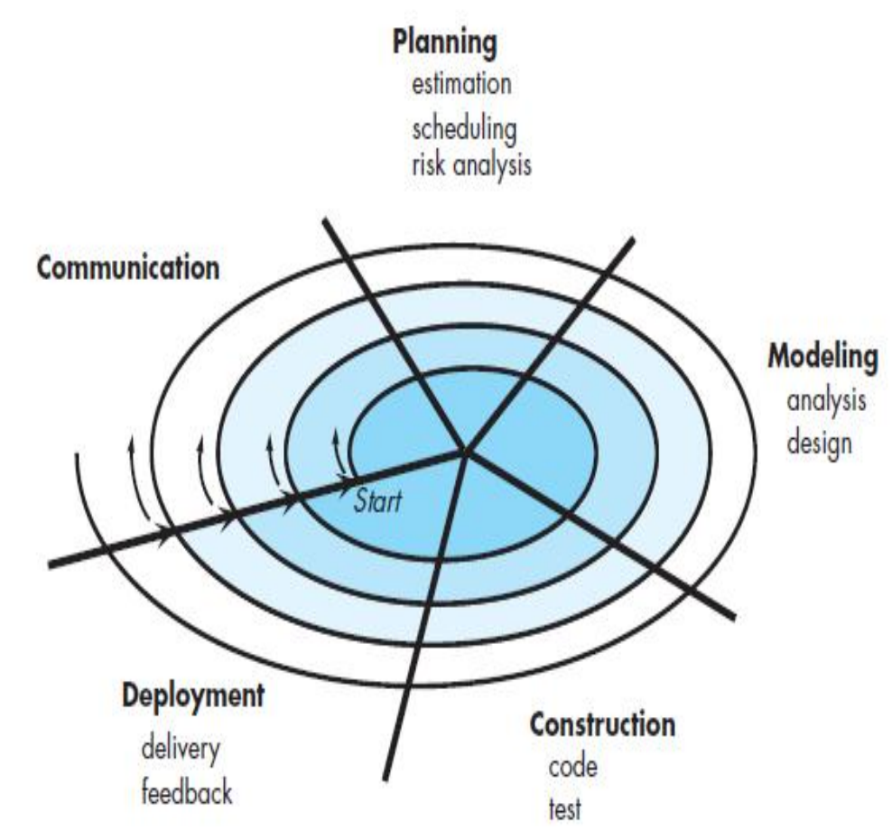

# Process Models
A process model provide a specific roadmap for software engineering work. It defines the **flow of all activities, actions and tasks**, **the degree of iteration**, **the work products**, and the organization of the **work that must be done**.
## Prescriptive Process Models
规定的，具体的，实际应用的过程模型

### The Waterfall Model
线性(Linear)/顺序(Sequential)模型

**最经典**的classic life cycle

主打一个理想化的尽量不要迭代回溯，那是因为之前的**需求非常清楚**

example for **planning**
- estimation: 工作定量化(Function Point & Use Case Point) **两个 工作量和开发成本换算模型(要考的)**
  - 例如一个人一个月要完成10个FP(function point)
  - 根据Use Case Diagram估算工作量 例如100FP/UCP
- schedule: 具体到时间安排，根据公司的知识库分配各个process的占比，乘以总的effort得到各个process的工作量，然后具体到每个人的时间分配
- tracking: 对schedule的实施跟踪

**特点**
- 顺序线性的不回溯的不迭代
- 需求明确
- 给需求到有应用的时间较长，可能开发周期长
- 一个process拖延了，后面的受阻
- 给后面的软件工程发展(V-model)奠定重要基础

V-model
软件测试和软件分析设计的映射关系，做每个过程都有对应的依据
极大地推进软件测试的发展

### Incremental Process Models
增量模型

觉得waterfall太久了，分成小的团队，一个团队给出最先半年的交付核心功能版本，另一个再给出一年后的升级版本。但注意每次交付都是可以运行的

一般不超过五次增量

**特点**
- 每次增量可能存在交叉重叠
- 后一个基于前一个增量，继续开发完善
- 每次增量一般都是waterfall
- 第一个增量是核心功能

### Evolutionary Process Models
演化模型

不要求需要那么明确，发现这个proces不对了，再回去改

#### The Prototypeing paradigm(范例)
customers not identify detailed requirements for
functions and features于是我们通过原型模型把**需求导出**
也是有一些**基本的业务逻辑**功能
他举的例子是云南省的结婚登记系统，甚至没有数据库，但是已经有可以有基本报表、打印结婚证等核心功能。只把界面留下来，其他抛弃掉了

**迭代**多几轮

- 快速设计、建模，不一定要满足所有需求规约(抛弃了数据库等)
- 根据客户的反馈再进行迭代

**不足**
- 甲方觉得你这么快就能开发出来了
- 算法、工程设计都没有，原型只是东凑西拼的

敏捷模型由此演化
#### The spiral paradigm(范例)

也是**迭代**的

现在要和全国的婚姻登记系统联网，用原型模型就不行了，原型对于其他的婚姻登记系统这些大量**外部**的接口很难导出需求

不同在于要做**风险分析**，因此适合于**高风险的/大的**项目

### Concurrent Models

### A Final Word on Evolutionary Process

## Specialized Process Model

## The Unified Process

## Personal and Team Process Models

