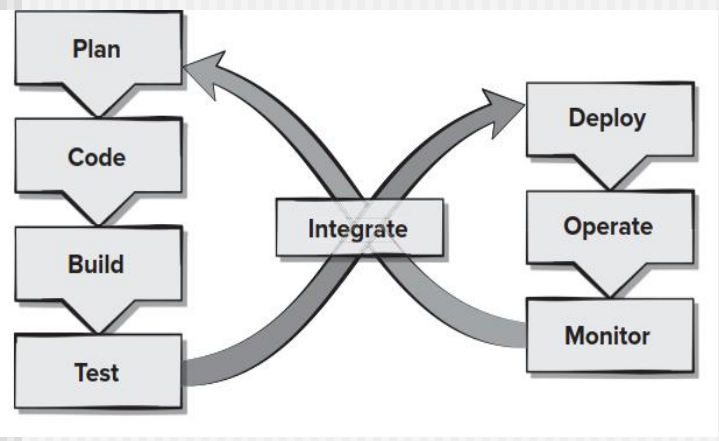

[TOC]
# AGILE DEVELOPMENT
重点是**XP** & **SCRUM**

- 适应现在技术、需求等等快速变化的开发(**各种各样的变更**)
  - build 包含 coding & testing
  - 技术
  - 人员
  - 等等影响项目开发的
- 甚至具有增量模型的特征，可以提前交付，但是第一次不一定是核心功能
- 激发小团队活力
- 设计、数据等建模不一定特别规范
- 开发过程简约
- 甲方和乙方共同成立一个团队
## WHAT IS AGILE
## AGILITY AND THE COST OF CHANGE
## AGILE PROCESS
### AGILITY PRINCIPLES
### The Politics of Agile Development
## Extreme Programming
## THE XP PROCESS
强调**测试先行**(又说考试要考)，写代码之前，根据详细设计的逻辑把测试用例先写出来，然后才开始写代码，写完了就单元测试了
extreme programming
可以和scrum交叉使用

一个圈就是一个sprint迭代
- planning
  - user stories
    - one user story indicates a **use case**
    - 但不是所有的用例，而是具体的、细化的小的用例
    - **例子**
      - 简单的成绩查询就是一个user story
      - 复杂的成绩查询**里面的**本科生成绩查询、硕士生成绩查询....才是user stories
  - valuse(优先级)
  - acceptance test criteria
    - 这些故事就是甲方做验收测试的依据
  - iteration plan
    - 根据values选择本次迭代要开发的stories
- design
  - simple design CRC cards(class-responsibility-collaborator)
    - 类的属性+方法就是其职责
    - 多个类之间的交互协作
    - 快速地把类设计出来、调用关系、微服务定义
    - 时序图：类的实例化对象之间的消息传递
  - spike solutions prototype
    - **例子**：设计类的某个类要用到机器学习模型，但是这个算法很复杂，把这个单独拿出来开发，作为一个原型去验证
- coding
  - coding之前**要先把测试用例unit test先写好**
  - pair programming
  - refactoring重构，结对编程都写完了，把代码冗余的不规范的修改
  - continuous integration，
    - 对于不同pair写的代码持续集成(慢慢往里面加)，还要通过集成测试来验证
    - 第一次、第二次...的迭代加进来的集成
- test
  - unit test
  - smoke testing，先不管其他的，先集成，冒烟了就是能跑了
  - 每次迭代加上去都能冒烟之后，再有system testing
  - 回归测试，增加新功能/修改bug，看原有的有没有问题
  - universal testing suit，每个类都有其测试套件
  - acceptance testing(甲方做的，看他接受度如何)
- release
  - software increment project velocity computed
  - 本次迭代完成的故事对总故事占比

迭代过程中，发现故事有问题，也不用改，记录到backlog中，下一次迭代再修改，不然本次迭代的进程就出问题了
## Industrial XP
## OTHER Agile Process Models

### SCRUM
查看路径`./ppt/scrum agile developoment.pdf`的文件
[zhihu_reference](https://zhuanlan.zhihu.com/p/398276773)

- 基于迭代、增量
- 整个开发包括多个小的迭代周期，2-4周
- 需求调研形成**故事story**，一个高内聚的独立的功能，这些故事组成 backlog 待办事项
  - 例如：成绩管理就是一个故事，其中包括本科生成绩管理、研究生成绩管理这些**任务**
  - 每次sprint迭代之后，优先级、story等都可能改变、增加等等
- 每个sprint根据优先级从xxx挑选出**故事**进行开发
  - 和incremental不同，首先挑出来的不一定是核心的能马上给用户用的

#### 角色
- product owner(参与scrum planning)
  - 确定产品功能
  - 发布日期和功能
  - 考虑成本回报，ROI(Return On Investment)负责
  - 根据市场价值确定功能优先级
  - 每个sprint，根据需要调整功能和优先级
  - 接收/拒绝开发团队的工作成果

- product master
  - 保证团队资源完全可利用和高产出(拖油瓶请出去)
  - 保证各个角色和职责良好协作
  - 解决团队开发中的障碍
  - 作为团队和外部的接口，屏蔽外部对团队的干扰
  - 保证开发过程按计划进行，组织daily scrum(30 min)/sprint review/sprint planning

- scrum team(负责产品开发，5-9人)
  - 一般情况人数在 5-9 个左右
  - 团队要跨职能（包括开发人员、测试人员、用户界面设计师等）
  - 团队成员需要全职。（有些情况例外，比如数据库管理员）
  - 在项目向导范围内，尽一切努力做任何事情已确保达到 Sprint 的目标。
  - 高度的**自组织**能力。
  - 向 Product Owner 演示产品功能。
  - 团队成员构成在 sprint 内不允许变化。

#### 燃尽图
**上次考到了emm**
动态跟踪本次sprint的情况和过程

蓝色的线是计划的每天的工作小时
红色的是动态的开发跟踪

#### sprint过程
**考试的时候让你多选题**
##### 计划会议
其中高层设计即为high level/architecture design
**例子**
一个项目要迭代4次，有四个sprint，那么应该是什么时候考虑架构设计(architecture design)呢
刚开始就要！

##### 每日站会
- 一天一次
- 上次到这次完成了什么
- 这次到下次准备做什么
- 汇报对象不是领导而是团队

非常重要，动态跟踪\

##### 评审会议
这次sprint改了什么架构、多了什么功能...

##### 回顾会议
回顾总结好的做法经验 -> 变成过程资产

### DevOps
开发与运维

每一次发现了问题，又回去

- Continuos development
- Continuos testing
- Continuos integration
- Continuos deployment
- Continuos minitoring