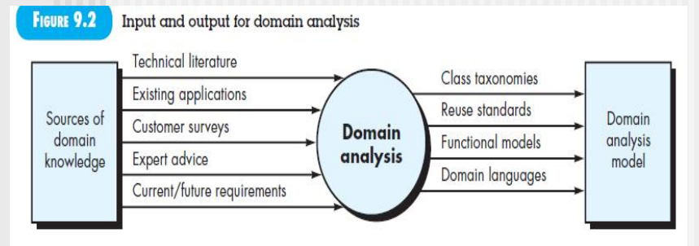
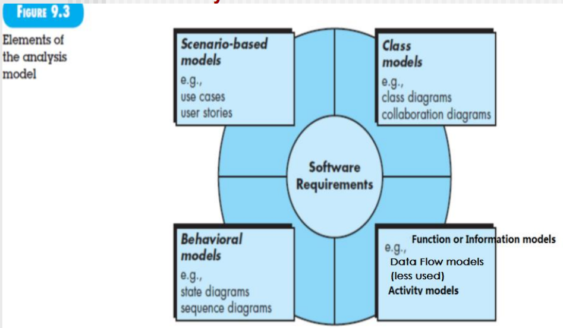
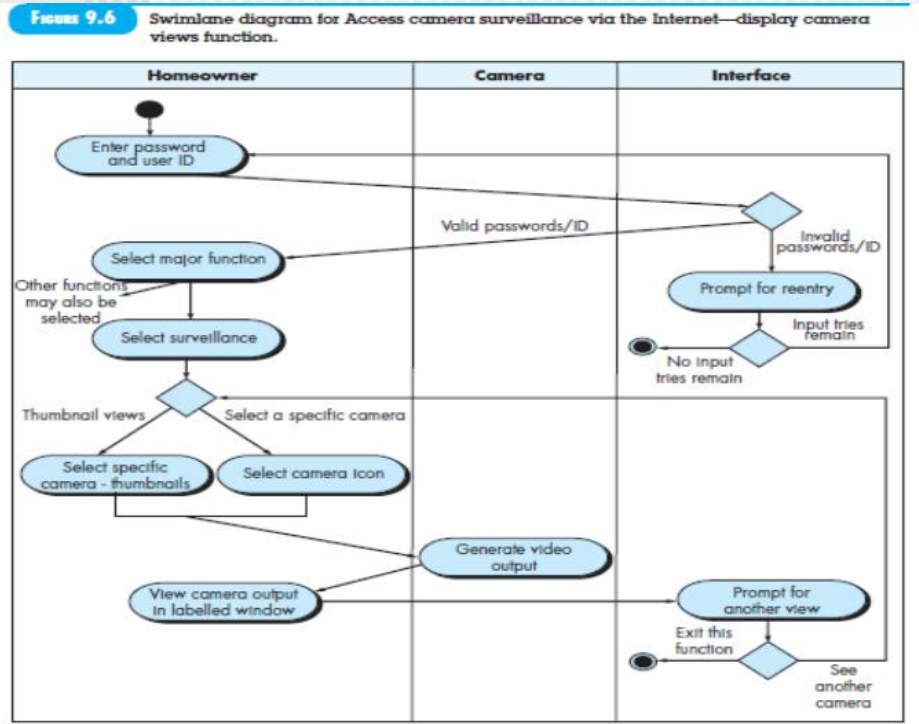

[TOC]
# REQUIREMENTS MODELING:SCENARIO- BASED METHODS

## Requirement Analysis

设计以分析为依据，分析以需求为依据
相互交叉(边界难以划分，一个做多一点，另一个甚至可以不做)**要考为什么**
以前一个为依据
界限不明显

需求规约
- 用例图
需求分析规约，分析建模
- 功能建模：活动图、泳道图
- 数据建模：类图，继承、聚合、关联关系
- 行为建模：状态图(系统级别的、类级别的)、时序图

### 分析建模法则
Arlow和Neustadt在创建分析模型时提出了一些值得遵循的经验法则：
- 模型应该着重于问题或业务领域中可见的需求。抽象级别应该相对较高。
- 需求模型的每个元素应该增加对软件需求的整体理解，并提供对系统的信息领域、功能和行为的洞察。
- 推迟对基础设施和其他非功能模型的考虑，直到进行设计阶段。
- 在整个系统中尽量**减少耦合**。
- 确保需求模型为所有利益相关者提供价值。
- 保持模型的简洁性。

### Domain Analysis
需求建模里面的 umbrella activity

对某个领域构建**业务类库**(**umbrella activity**，都标准化了成本低了，质量就提高了)
找出 analysis patterns, analysis classes and information 其他人可能再用到的

**要考**来怎么分析

Class taxonomies 找词组分类
类的属性定于、方法的定义、参数的定义**标准化**，才有利于**复用**
每个类的功能要说清楚
Domain languages UML语言等、用某种符号体系给表示出来

都是智力资产

需求工程
- 两个规约
  - 需求规约
  - 需求分析规约
- 四个建模
  - Scenario-based models: use cases, user stories
  - Class models: class diagrams, collaboration diagrams
  - Behavioral model: state diagram, sequence diagrams
  - Function or information models: Data flow models(less used), activity diagrams

一个用例要完成对应功能，大多数是对用例里面的类的调用；也可以有其他的用例的类，但要尽量少

这里就包括了基本流和异常流
构建活动图 和 基本流、异常流相互对应、迭代

活动图的升级，每个类要做的事给说明

这里interface类有界面的可能要访问数据库的，这里可以不画，但是时序图里面要体现
