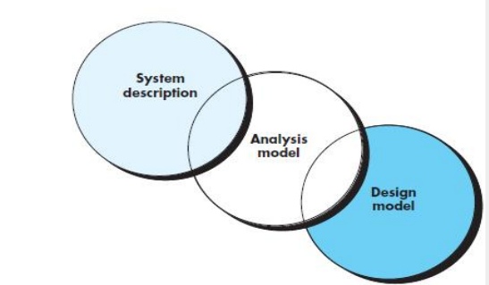

# REQUIREMENTS MODELING:SCENARIO- BASED METHODS

相互交叉
以前一个为依据
界限不明显

## 分析建模法则
Arlow和Neustadt在创建分析模型时提出了一些值得遵循的经验法则：
- 模型应该着重于问题或业务领域中可见的需求。抽象级别应该相对较高。
- 需求模型的每个元素应该增加对软件需求的整体理解，并提供对系统的信息领域、功能和行为的洞察。
- 推迟对基础设施和其他非功能模型的考虑，直到进行设计阶段。
- 在整个系统中尽量**减少耦合**。
- 确保需求模型为所有利益相关者提供价值。
- 保持模型的简洁性。
