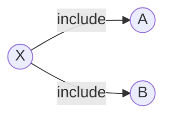
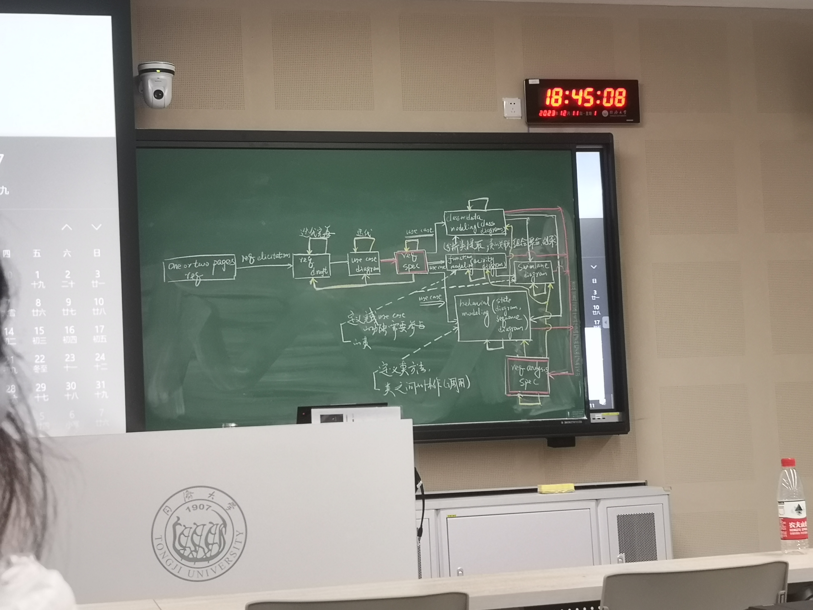

# 需求规约 第十周晚11.13
- 文字性描述
  - 功能性需求
  - 非功能性需求
    - 性能
    - 压力
    - 安全性
    - 兼容性
    - 可移植性
- use case diagram
  - 主要是功能性需求
- 用例规约
  - 正常流
  - 备选流

# 功能性需求
搞清楚边界
- 内部实现的功能
- 外部实现的功能
  - external interface别人提供的，例如微信支付，课程项目可以模拟，单独开发
  - 外部系统接口，财务系统和人事系统相结合
  - 有很多设备

# 非功能需求
关注重点
例子：15s内完成微信支付，**性能/压力的需求**
下载开源的压力测试工具，模拟高并发
**安全性，动态加密，登录的加密，数据在数据库中的加密，传输时候的加密，前端密码区分大小写等**

# 开始讲
首先确定actor

一个子系统来自用例图

一个子系统里面可能有多个类

多个类有可能属于一个或多个微服务

**为什么要定义子系统**
- 根据use case把功能相近的放在一起
- 不同子系统类之间有很多调用，在子系统里面定义**接口类**，不同子系统之间的调用通过接口访问，具体实现修改了，其他的跟着一起修改的少

关联关系
- 双向关联
- ...

最重要的是**异常流**，XXX不存在(需求调研中导出)
能够定义的业务逻辑异常
例如：校卡坏了、借书卡过期了

- 需求规约：what to do，文字描述和用例图
需求分析建模：
  - 数据建模：分析类图(而不是写代码那个类)、从数据的角度分析
  - 功能建模：Activity Diagram，功能逻辑流，抽象整个系统的流程
  - 行为状态建模：state Diagram，定义类的方法、sequential diagram
  - 还可以分成前端和后端的需求规约

- 概要设计建模
  - 软件的体系架构设计: B/S or C/S、那些类构成子系统
    - 此前需要将分析类图转换为设计类图
      - 类的聚合关系
      - 集成
  - 数据库设计
  - 接口设计

# use case diagram
什么时候分出用例

- 一个用例至少需要两个业务类来完成(对应出的时序图只有一个类就没有交互了)，因此有些用例不用分出来
- 就是一个方法或者一条语句或者一个简单的逻辑就没必要分出来单个用例
- 如果是extend一个**比较特殊，额外的，很关键，不常发生，需要被关注的**，简单的一个方法也可以分出一个用例(作为指向的一个方法else调用的方法)

那一个子系统只有一个用例合适吗
那增删改查都合并为一个用例的事件流怎么写
# class diagram
分析类图

# activity diagram
活动图对应一个use case的功能逻辑图
泳道图是活动图的升级，特定的功能需要**特定的类**指示出来(分析类、初步的类)

# sequence diagram
每个类(分析类)是怎么协作的

# 定义通用的类
很多地方都要访问的同一张表都调用这个类

此前都不涉及技术栈(概要设计及其之前)
# class diagram
设计类图
现在才细化
controller就是一个前后端的接口类，不干实事

# 第一组讲评
第三方都是actor

health的登录两个include就可以了

include不能超过两级

用例图不是流图，只用有include/extend关系

性能需求要定量化？

加密的通用的身份验证的动态静态的加密方法
还有数据库里面的的加密方法

饼状图、柱状图数据可视化

# 

一两页的需求到需求调研
构建use case diagram
形成需求规约，对基本流和异常流有详细描述
之后都以use case为依据，进行类/数据建模、功能建模、行为建模 功能构成需求分析规约
- 分析类的聚合关系、关联关系、继承关系 class diagram
- activity diagram功能流，swimlane diagram在活动图基础上说明需要哪些类来参与
- state diagram定义类的方法，sequence diagram定义类之间的协作

出来之后都可以评审之后返回修改

# 
类图
有继承关系，一般不和父类发生关联，父类相当于超类
组合关系写清楚谁少了谁就不存在了