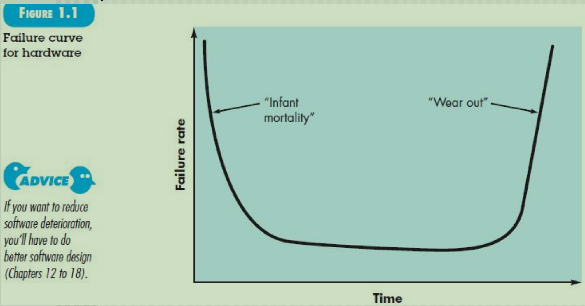
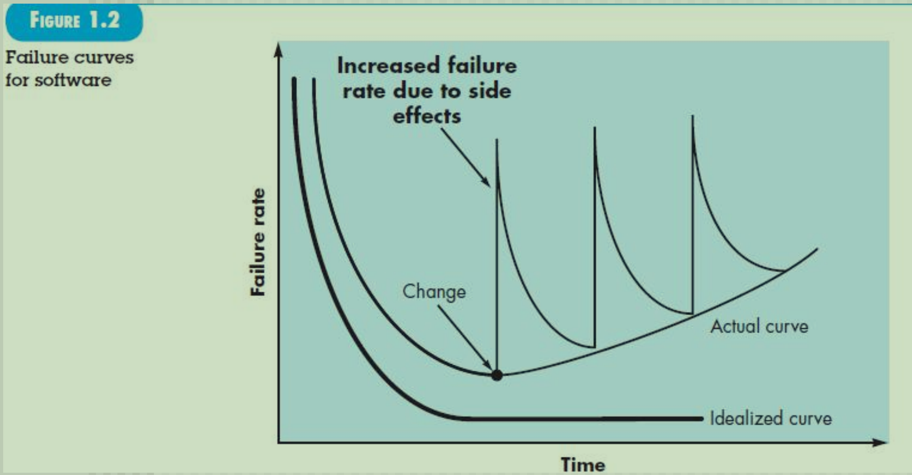

# defining software
## 笼统的
- 产品
- 信息传递、转换的工具，这里提醒我们要有安全意识，不要信息泄露
- 经济发展的dominant factor

## 很多为什么
### Why long time to finish
- 需求调研不清楚，开发过程中不断迭代
- 分析建模等stages不规范，过程控制不行
- 基础不行，没培训

### Why costs high
### Why 不能交付前找出所有errors
- 业务逻辑/流/路径 是无穷的
- 需求调用功能没实现，不符合需求
  - 例如要两位小数，结果只实现了一位小数
  - 整个过程中遇到的各种问题都是errors，其中一些errors导致failure，这些errors成为defect缺陷
### Why so much time & effort for maintenance
- Alops
- 模块各种各样接口，改一个动很多
### Why measuring progress 难
- 我们利用甘特图解决

## definition
1. 指令/代码/程序 满足
   1. features特性、非功能性需求，可移植性、可拓展性等
   2. function
   3. performance性能，其实也属于非功能性需求
2. data structure 数据 处理信息流
   1. static data
   2. dynamic data
3. 各种各样的文档 规约、使用手册...

### 简单抽象
software = program(code) + data(static / dynamic) + document(specification)

## 特性
### 硬件
bathtub curve

- 时间长了wear out磨损
- easy to replacce

### 软件
理想曲线和实际曲线
经历很多changes(corrected/adapted/enhanced)failure rate就慢慢上升了因为有side effect
还不能替换

## Software Application Domain
分类都是有交叉的

- System software
  - 路由器的TCP
  - 操作系统
- Application software
  - 不联网的单机的
  - stand-alone programs that solve a specific business need
- Engineering/scientific software
  - DS、AI交叉
  - 各种各样的算法
- Embedded software
  -  也是算法
  -  收集数据的小车车
- Product-line software
- Web/Mobile application
  - PC机用浏览器
  - 手机用应用
- Artificial intelligence software

## Legacy Software遗留软件

### 描述
- 遗留核心功能和重要数据
- 但是很老，很难改、难扩展
- 不断change，使用过程中风险不断提高

### 特征
- longevity
- business criticality
- poor quality

### 解决方法
#### 重新开发
成本大
#### 不断演化evolve
涉及到的四个方面
- must be **adapted** to meet the needs of new computing **environment** or **technology**
   - 例子
     - 以前手工采购，手动填写订单
     - 现在联网采购
- must be **enhanced** to implement new business **requirements**
- must be extended to make it **interoperable** with other more modern systems or databases
  - 和其他系统、数据库交互
- must be **re-architected** to make it viable within a evolving compluting environment
  - 最难的，重新构建架构

# the changing nature of software

## WebApps Exercise
by looking up information, to learn the history of web development.(web1.0~web4.0)
## Mobile App
## Cloud Computing
**特别重要**
现在所有基本上都基于K8s整个开源的管理系统、分布式的云架构，功能非常强大
实现按需分配，实时迁移虚拟机资源

开发就是管理这几个层

### 架构分层
- 资源层
- 虚拟层
- 中间件层
- 应用层

- IaaS(Infrastructre as a Service)资源层或基础设施层
   - 在物理机群上建立虚拟机，最大化资源利用率
   - KVM技术，基于硬件的完全虚拟化
   - XEN
- PaaS(Platform as a Service)中间件层或平台层，都是开发的时候完成
  - 资源监测: 监测CPU、内存等使用情况
  - 预警: 设置阈值就报警响应
  - 优化决策: 资源调度(迁移或伸缩)
- SaaS

### 发展历史
- **Traditional deployment era**: Early on, organizations ran applications on **physical servers**. There was no way to define resource boundaries for applications in a physical server, and this caused resource allocation issues. For example, if multiple applications run on a physical server, *there can be instances where one application would take up most of the resources, and as a result, the other applications would underperform.* A solution for this would be to run each application on a different physical server. But this *did not scale* as resources were underutilized, and it was expensive for organizations to maintain many physical servers.
- **Virtualized deployment era**: As a solution, virtualization was introduced. It allows you to run multiple Virtual Machines (VMs) on a single physical server's CPU. Virtualization allows applications to be isolated between VMs and provides a level of security as the information of one application cannot be freely accessed by another application. Virtualization allows better utilization of resources in a physical server and allows better scalability because an application can be added or updated easily, reduces hardware costs, and much more. With virtualization you can present a set of physical resources as a cluster of disposable virtual machines.Each VM is a full machine running all the components, including its own operating system, on top of the virtualized hardware.
- **Container deployment era**: Containers are similar to VMs, but they have relaxed isolation properties to share the Operating System (OS) among the applications. Therefore, containers are considered **lightweight**. Similar to a VM, a container has *its own filesystem, share of CPU, memory, process space, and more.* As they are decoupled from the underlying infrastructure, they are portable across clouds and OS distributions.
  - Agile application creation and deployment
  - Continuous development, integration, and deployment
  - Dev and Ops separation of concerns(开发和运维分开关注)
  - Obervability
  - Environmental consistency across development, testing, and production
  - Cloud and OS distribution portability
  - Application-centric management
  - Loosely coupled, distributed, elastic, liberated micro-services
  - Resource isolation
  - Resource utilization

### K8s
Kubernetes provides you with:

- **Service discovery and load balancing** 
Kubernetes can expose a container using the DNS name or using their own IP address. If traffic to a container is high, Kubernetes is able to load balance and distribute the network traffic so that the deployment is stable.
- **Storage orchestration Kubernetes** 
allows you to automatically mount a storage system of your choice, such as local storages, public cloud providers, and more.
- **Automated rollouts and rollbacks**
You can describe the desired state for your deployed containers using Kubernetes, and it can change the actual state to the desired state at a controlled rate. For example, you can automate Kubernetes to create new containers for your deployment, remove existing containers and adopt all their resources to the new container.
- **Automatic bin packing** 
You provide Kubernetes with a cluster of nodes that it can use to run containerized tasks. You tell Kubernetes how much CPU and memory (RAM) each container needs. Kubernetes can fit containers onto your nodes to make the best use of your resources.
- **Self-healing**
Kubernetes restarts containers that fail, replaces containers, kills containers that don't respond to your user-defined health check, and doesn't advertise them to clients until they are ready to serve.
- **Secret and configuration management**
Kubernetes lets you store and manage sensitive information, such as passwords, OAuth tokens, and SSH keys. You can deploy and update secrets and application configuration without rebuilding your container images, and without exposing secrets in your stack configuration.