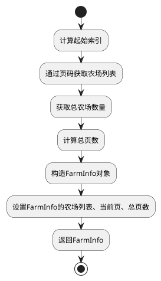
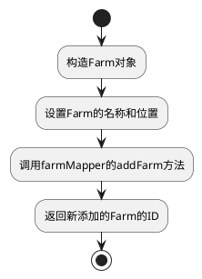
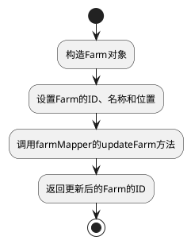
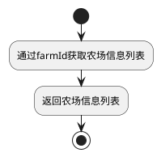

```plantuml
@startuml

start
:计算起始索引;
:通过页码获取农场列表;
:获取总农场数量;
:计算总页数;
:构造FarmInfo对象;
:设置FarmInfo的农场列表、当前页、总页数;
:返回FarmInfo;

stop
@enduml

```

```plantuml
@startuml

start
:构造Farm对象;
:设置Farm的名称和位置;
:调用farmMapper的addFarm方法;
:返回新添加的Farm的ID;

stop

@enduml

```

```plantuml
@startuml

start
:构造Farm对象;
:设置Farm的ID、名称和位置;
:调用farmMapper的updateFarm方法;
:返回更新后的Farm的ID;

stop

@enduml

```

```plantuml
@startuml

start
:通过farmId获取农场信息列表;
:返回农场信息列表;

stop

@enduml

```