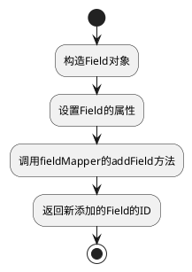
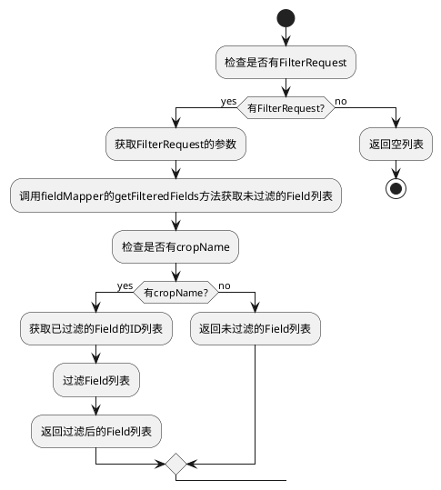
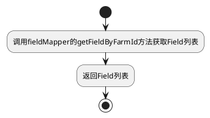
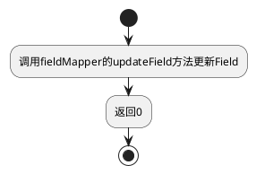
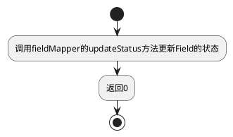

```plantuml
@startuml

start
:构造Field对象;
:设置Field的属性;
:调用fieldMapper的addField方法;
:返回新添加的Field的ID;

stop

@enduml

```

```plantuml
@startuml

start
:检查是否有FilterRequest;
if (有FilterRequest?) then (yes)
  :获取FilterRequest的参数;
  :调用fieldMapper的getFilteredFields方法获取未过滤的Field列表;
  :检查是否有cropName;
  if (有cropName?) then (yes)
    :获取已过滤的Field的ID列表;
    :过滤Field列表;
    :返回过滤后的Field列表;
  else (no)
    :返回未过滤的Field列表;
  endif
else (no)
  :返回空列表;

stop

@enduml

```

```plantuml
@startuml

start
:调用fieldMapper的getFieldByFarmId方法获取Field列表;
:返回Field列表;

stop

@enduml

```

```plantuml
@startuml

start
:调用fieldMapper的updateField方法更新Field;
:返回0;

stop

@enduml

```

```plantuml
@startuml

start
:调用fieldMapper的updateStatus方法更新Field的状态;
:返回0;

stop

@enduml

```