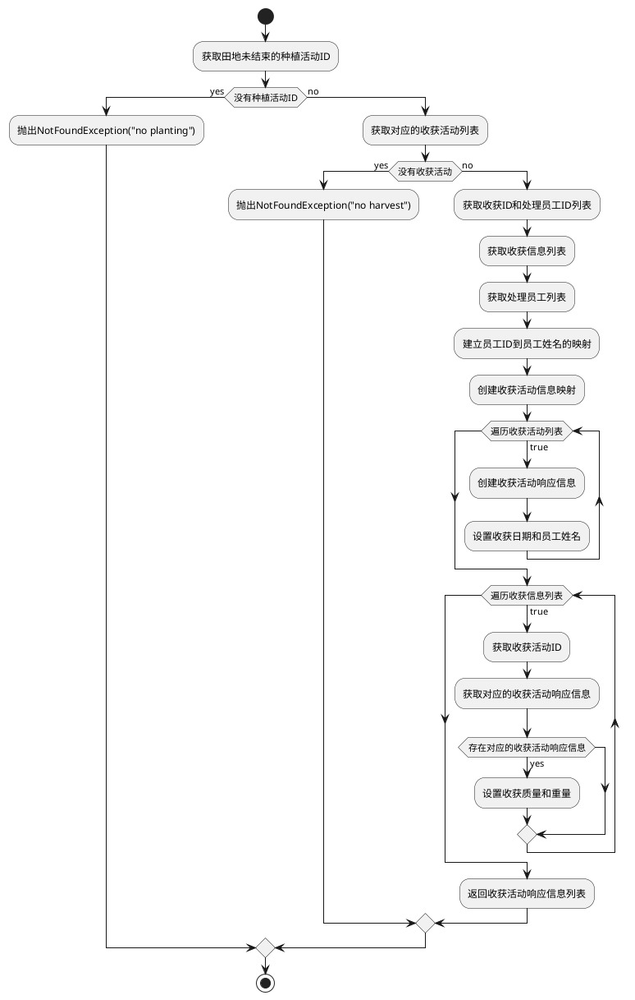
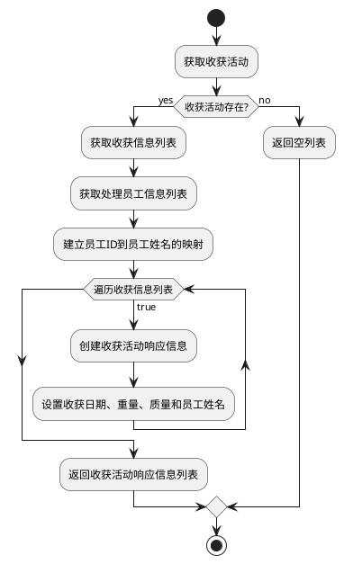
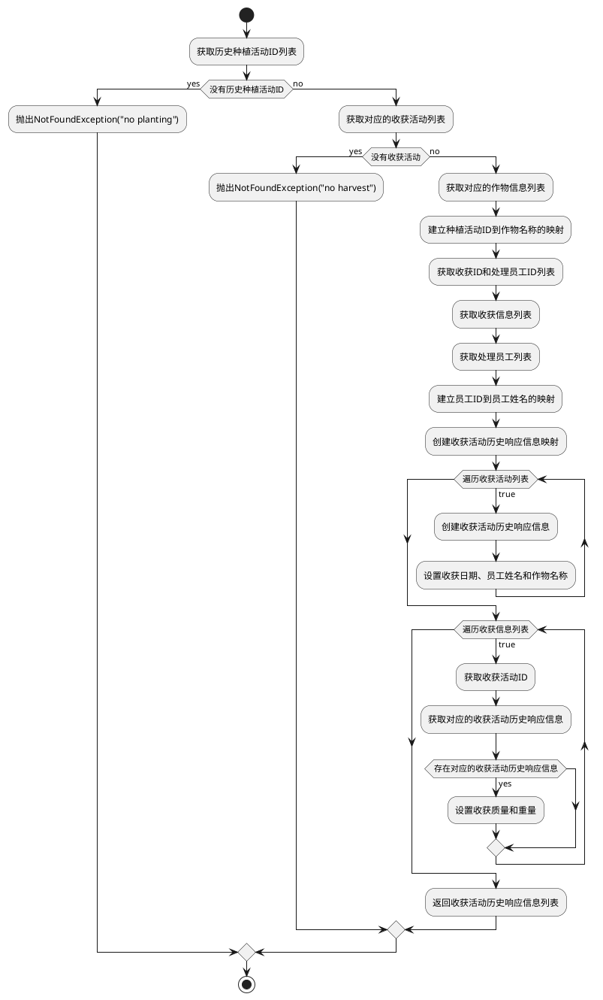
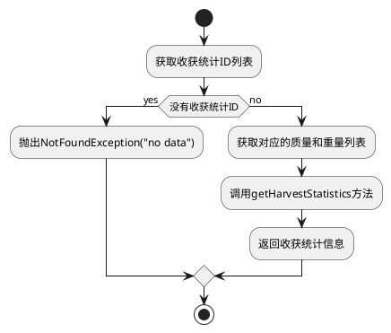
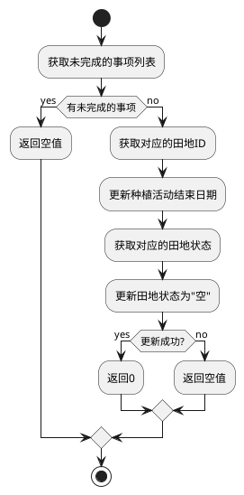

```plantuml
start
  :获取活动信息;
  if (查不到对应的 activity) then (是)
    :抛出异常 "no activity";
  else (否)
    :构建 Activity返回值;
  endif
  stop

```

```plantuml
@startuml

start
:获取田地未结束的种植活动ID;
if (没有种植活动ID) then (yes)
  :抛出NotFoundException("no planting");
else (no)
  :获取对应的收获活动列表;
  if (没有收获活动) then (yes)
    :抛出NotFoundException("no harvest");
  else (no)
    :获取收获ID和处理员工ID列表;
    :获取收获信息列表;
    :获取处理员工列表;
    :建立员工ID到员工姓名的映射;
    :创建收获活动信息映射;
    
    while (遍历收获活动列表) is (true)
      :创建收获活动响应信息;
      :设置收获日期和员工姓名;
    endwhile
    
    while (遍历收获信息列表) is (true)
      :获取收获活动ID;
      :获取对应的收获活动响应信息;
      if (存在对应的收获活动响应信息) then (yes)
        :设置收获质量和重量;
      endif
    endwhile
    
    :返回收获活动响应信息列表;
  endif
endif

stop

@enduml

```

```plantuml
@startuml

start
:获取收获活动;
if (收获活动存在?) then (yes)
  :获取收获信息列表;
  :获取处理员工信息列表;
  :建立员工ID到员工姓名的映射;

  while (遍历收获信息列表) is (true)
    :创建收获活动响应信息;
    :设置收获日期、重量、质量和员工姓名;
  endwhile

  :返回收获活动响应信息列表;
else (no)
  :返回空列表;
endif

stop

@enduml

```

```plantuml
@startuml

start
:获取历史种植活动ID列表;
if (没有历史种植活动ID) then (yes)
  :抛出NotFoundException("no planting");
else (no)
  :获取对应的收获活动列表;
  if (没有收获活动) then (yes)
    :抛出NotFoundException("no harvest");
  else (no)
    :获取对应的作物信息列表;
    :建立种植活动ID到作物名称的映射;
    :获取收获ID和处理员工ID列表;
    :获取收获信息列表;
    :获取处理员工列表;
    :建立员工ID到员工姓名的映射;
    :创建收获活动历史响应信息映射;

    while (遍历收获活动列表) is (true)
      :创建收获活动历史响应信息;
      :设置收获日期、员工姓名和作物名称;
    endwhile
    
    while (遍历收获信息列表) is (true)
      :获取收获活动ID;
      :获取对应的收获活动历史响应信息;
      if (存在对应的收获活动历史响应信息) then (yes)
        :设置收获质量和重量;
      endif
    endwhile

    :返回收获活动历史响应信息列表;
  endif
endif

stop

@enduml

```

```plantuml
@startuml

start
:获取收获统计ID列表;
if (没有收获统计ID) then (yes)
  :抛出NotFoundException("no data");
else (no)
  :获取对应的质量和重量列表;
  :调用getHarvestStatistics方法;
  :返回收获统计信息;
endif

stop

@enduml

```

```plantuml
@startuml

start
:获取未完成的事项列表;
if (有未完成的事项) then (yes)
  :返回空值;
else (no)
  :获取对应的田地ID;
  :更新种植活动结束日期;
  :获取对应的田地状态;
  :更新田地状态为"空";
  if (更新成功?) then (yes)
    :返回0;
  else (no)
    :返回空值;
  endif
endif

stop

@enduml

```

