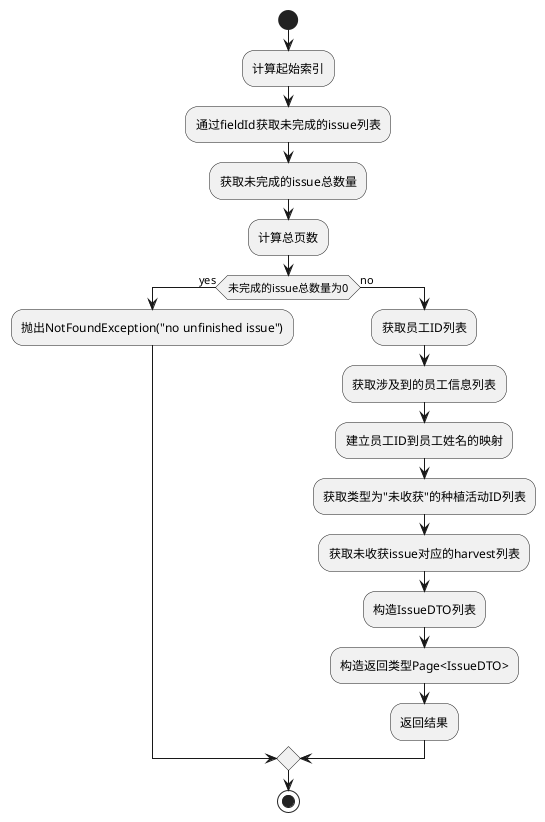
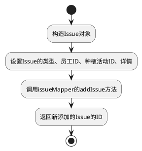

```plantuml
@startuml

start
:计算起始索引;
:通过fieldId获取未完成的issue列表;
:获取未完成的issue总数量;
:计算总页数;
if (未完成的issue总数量为0) then (yes)
  :抛出NotFoundException("no unfinished issue");
else (no)
  :获取员工ID列表;
  :获取涉及到的员工信息列表;
  :建立员工ID到员工姓名的映射;
  :获取类型为"未收获"的种植活动ID列表;
  :获取未收获issue对应的harvest列表;
  :构造IssueDTO列表;
  :构造返回类型Page<IssueDTO>;
  :返回结果;
endif

stop

@enduml

```

```plantuml
@startuml

start
:构造Issue对象;
:设置Issue的类型、员工ID、种植活动ID、详情;
:调用issueMapper的addIssue方法;
:返回新添加的Issue的ID;

stop

@enduml

```