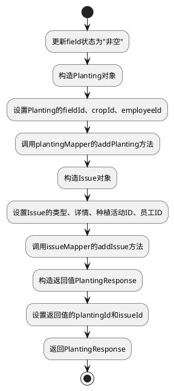

```plantuml
@startuml

start
:更新field状态为"非空";
:构造Planting对象;
:设置Planting的fieldId、cropId、employeeId;
:调用plantingMapper的addPlanting方法;
:构造Issue对象;
:设置Issue的类型、详情、种植活动ID、员工ID;
:调用issueMapper的addIssue方法;
:构造返回值PlantingResponse;
:设置返回值的plantingId和issueId;
:返回PlantingResponse;

stop

@enduml

```