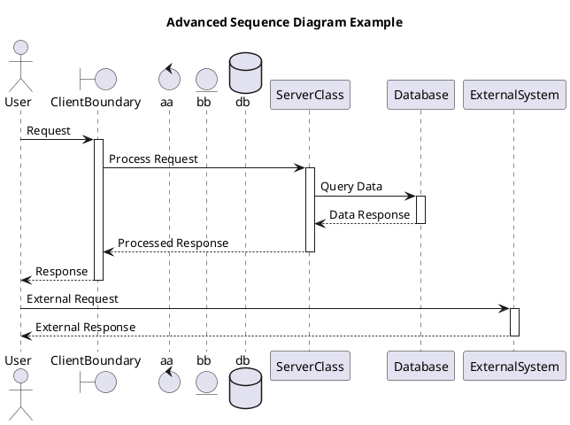

```plantuml
@startuml
title Advanced Sequence Diagram Example

actor User
boundary ClientBoundary
control aa
entity bb
database db

User -> ClientBoundary: Request
activate ClientBoundary
ClientBoundary -> ServerClass: Process Request
activate ServerClass
ServerClass -> Database: Query Data
activate Database
Database --> ServerClass: Data Response
deactivate Database
ServerClass --> ClientBoundary: Processed Response
deactivate ServerClass
ClientBoundary --> User: Response
deactivate ClientBoundary

User -> ExternalSystem: External Request
activate ExternalSystem
ExternalSystem --> User: External Response
deactivate ExternalSystem

@enduml

```