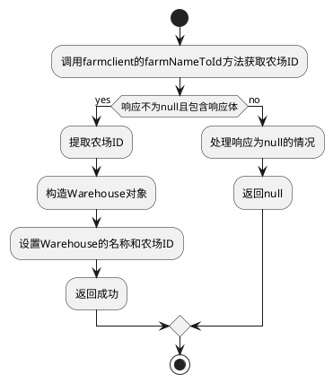
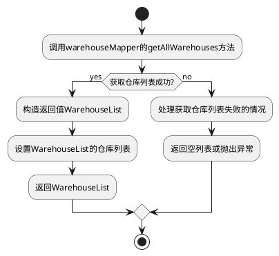

```plantuml
@startuml

start
:调用farmclient的farmNameToId方法获取农场ID;
if (响应不为null且包含响应体) then (yes)
  :提取农场ID;
  :构造Warehouse对象;
  :设置Warehouse的名称和农场ID;
  :返回成功;
else (no)
  :处理响应为null的情况;
  :返回null;
endif

stop

@enduml

```

```plantuml
@startuml

start
:调用warehouseMapper的getAllWarehouses方法;
if (获取仓库列表成功?) then (yes)
  :构造返回值WarehouseList;
  :设置WarehouseList的仓库列表;
  :返回WarehouseList;
else (no)
  :处理获取仓库列表失败的情况;
  :返回空列表或抛出异常;
endif

stop

@enduml

```