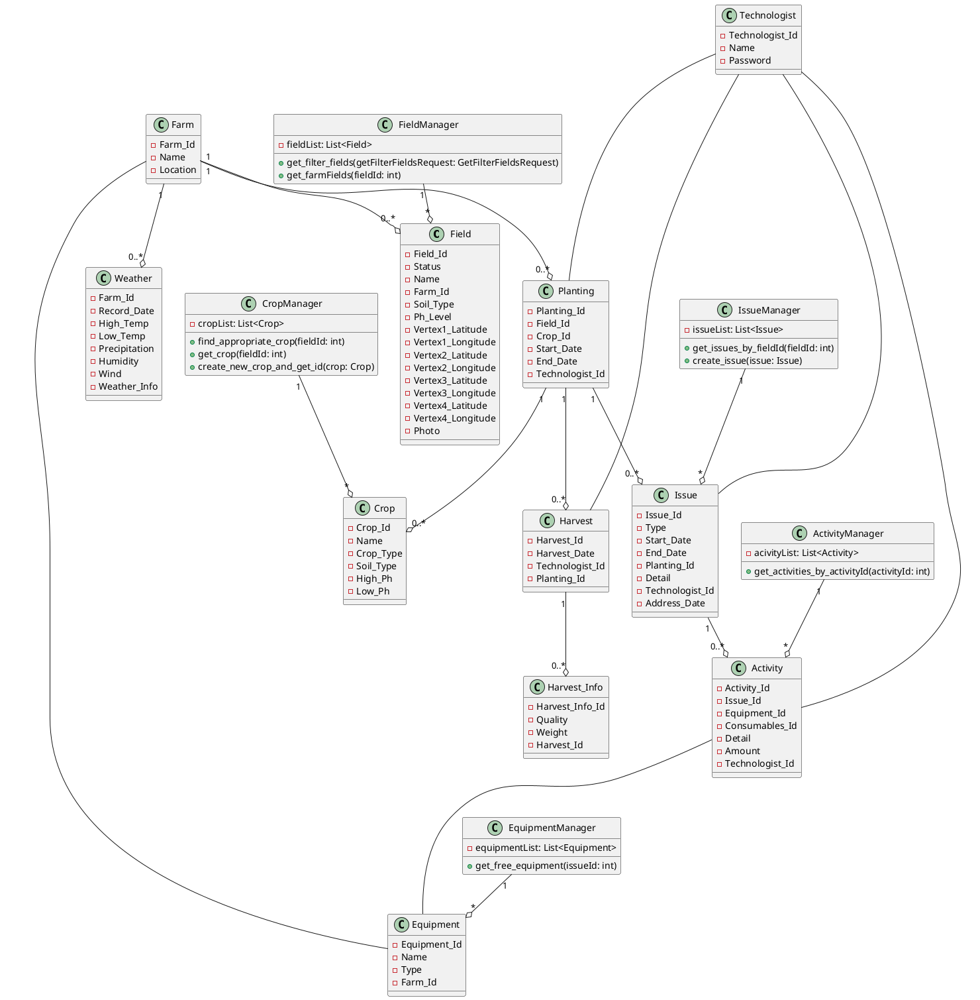

Get_Free_Consumables(int issue_id)??
create_planting_and_issue(int field_id, int crop_id, string dateString, int technologist_id)??
solve_issue_by_equipment(int issue_id, int? equipment_id, int? consumables_id, string dateString, int technologist_id)??
