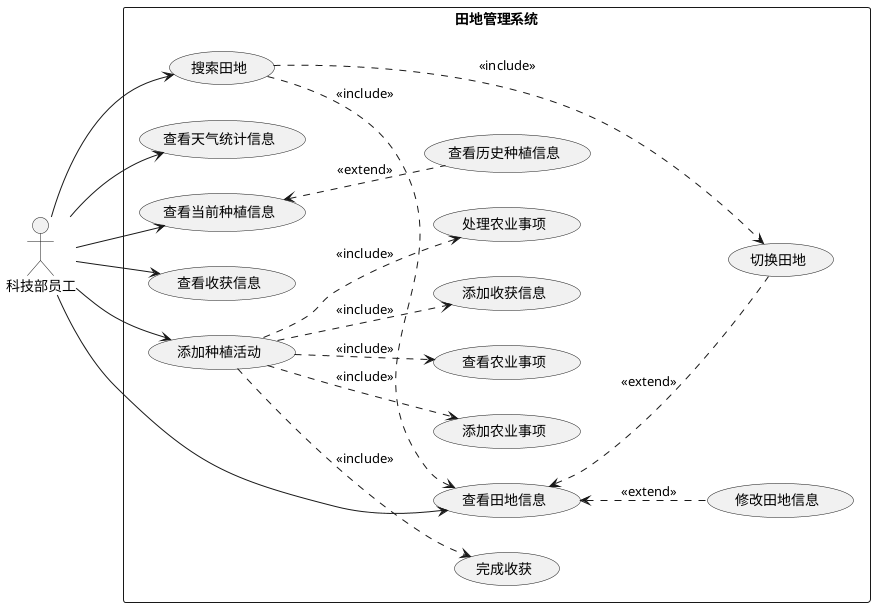

# Tasks 
- Use Case Diagram

- Requirement Analysis

- 总体Data Modeling in Sub-system

# Ranging
- 田地编辑
- 田地高级搜索
- 田地切换(2种方式)
- 天气管理
- 开始种植
- 终止种植
- 种植历史
- 添加事项
  - 常规
  - 智能方案
  - ..
- 事项解决中
- 解决中事项 -> 已完成
- 添加收获
- 收藏历史

# Use Case Diagram for 田地管理
