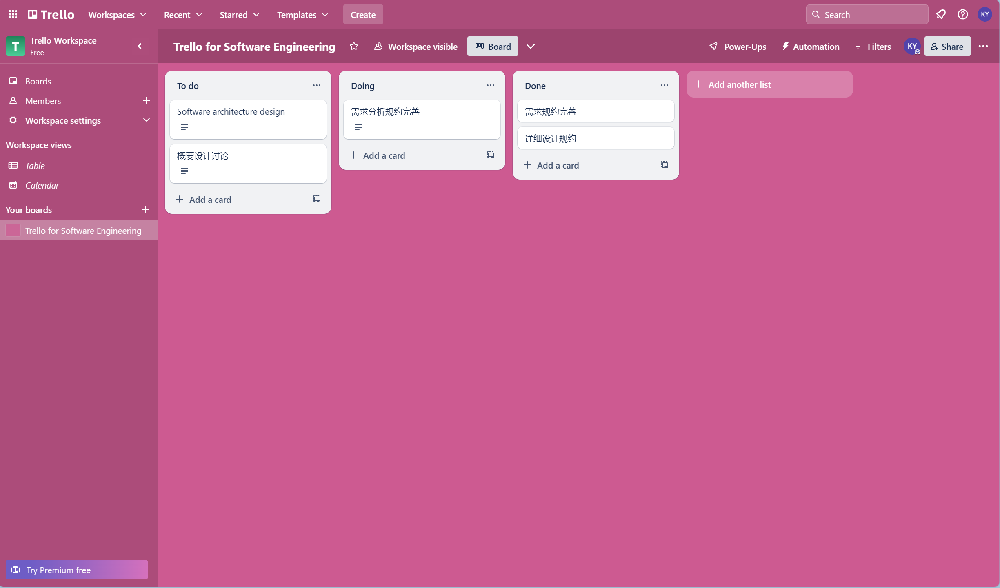
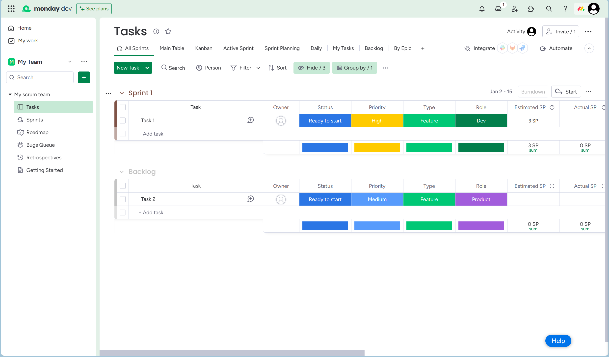
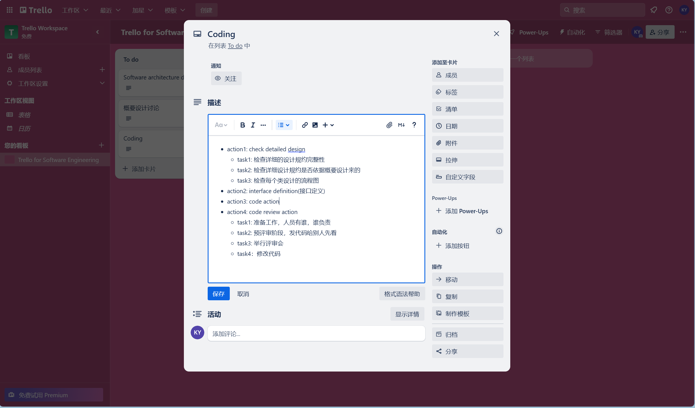
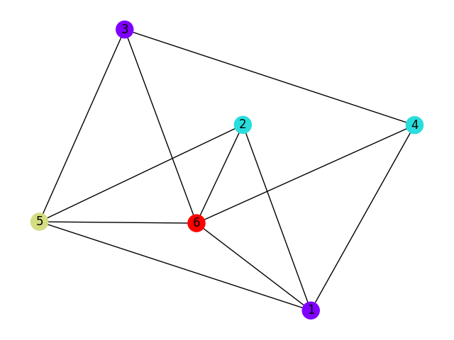
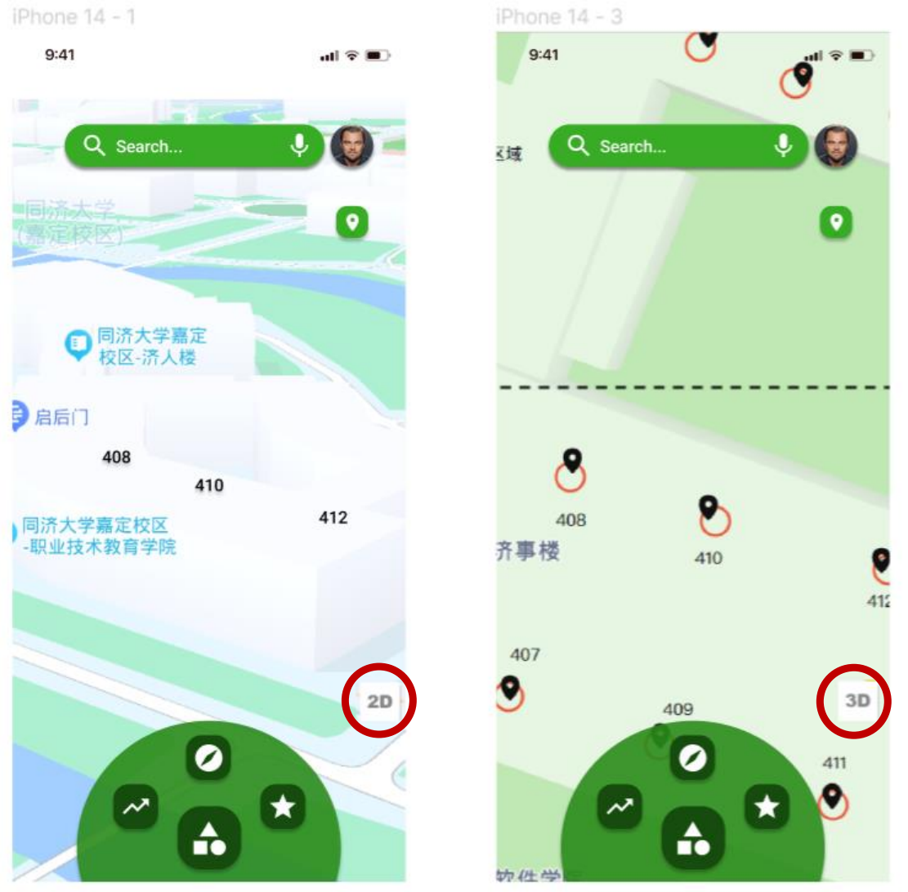
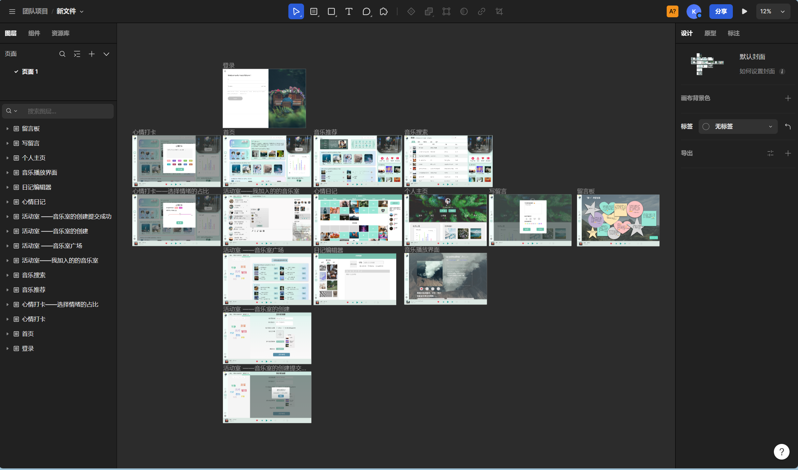

[TOC]
# 1. 微服务 & DevOps
## 微服务
- Wiki: 是一种软件架构风格，它是以专注于**单一责任与功能**的小型功能区块 (Small Building Blocks) 为基础，利用**模块化**的方式组合出复杂的大型应用程序，各功能区块使用与语言无关 （Language Independent），而且复杂的服务背后是使用简单 URI 来开放接口，任何服务，任何细粒都能被开放（exposed）。
- 每个微服务自由拥有自己的进程与轻量化处理，服务依业务功能设计，以全自动的方式部署，与其他服务使用 HTTP API 通信。
- 容器技术 (Container Technology) 如 Docker 会更加地适合发展微服务的运算资源管理技术。

## DevOps
- 定义：DevOps（Development和Operations的组合词）是一组过程、方法与系统的统称，用于促进开发（应用程序/软件工程）、技术运营和质量保障（QA）部门之间的沟通、协作与整合。DevOps一词的来自于Development和Operations的组合，突出重视软件开发人员和运维人员的沟通合作，通过自动化流程来使得软件构建、测试、发布更加快捷、频繁和可靠。
- 特点：DevOps提倡小规模和增量的批量大小，而微服务架构帮助我们以一种细粒度的方式开发、测试和发布服务。
- 目标：DevOps希望做到的是软件产品交付过程中IT工具链的打通，使得各个团队减少时间损耗，更加高效地协同工作。**DevOps的一个巨大好处就是可以高效交付，这也正好是它的初衷。**

规划与设计→代码→构建→测试→发布→部署→运维→监控
- 持续开发
- 持续测试
- 持续集成
- 持续部署
- 持续监控

## 微服务与DevOps的关系

微服务与devops是相辅相成的，微服务类似工厂流水线上的产品，而devops类似流水线本身。

## 微服务|DevOps解决的问题

把一个大的单体应用拆分成多个微服务之后，每个服务都可以独立进行开发、测试和运维。

- 微服务的实施，必然会涉及多个微服务之间的协作，那么对微服务功能进行**单元测试、回归测试、性能测试将变得更加复杂**，如果不采用**自动化工具**，工作量之大，复杂度之高，难以估量。需求的管理，则项目的管控将异常艰巨
- 微服务部署所依赖的基础环境，必将异常复杂繁琐，，必然会频繁的进行应用的更新，代码编译、版本控制、代码质量将无法保证

# 2. the history of web development
[ref](https://blog.csdn.net/sinat_29485667/article/details/81147705)
## web1.0
Web1.0–**信息共享**。虽然人们为着信息共享已经奋斗了很多年，但直到Web技术的出现并逐步完善之今，信息共享也还远未令人满意。但比起之前的其它技术，如ftp等，自描述性赋予了Web系统强大的生命力，使得Web成为信息共享的第一设施。
## web2.0
Web2.0–**信息共建**。直到Web1.0时代，信息也还都是单向的，由话语权集团发出。普通百姓只有听的份儿，而Web2.0则赋予了普通百姓一样的话语权，意识表达空前活跃，特别是在意识形态禁锢的社会里。如此必然导致网络信息的泛滥：陷阱病毒成灾，如今杀毒软件倒成了计算机第一应用了；垃圾信息遍野，如果找到适合于自己的信息，就成了网民的需要，因此**搜索引擎崛起**。但搜索引擎并不能杜绝陷阱病毒，也不能区分垃圾信息，更不能系统化Web信息，因此技术探索就成为必然。
## web3.0
Web3.0–**知识传承**。计算机是人类的意识外化，其每一点进步，都必然聚合了更多人的智慧。**集聚人类智慧为人类共享，是计算机科学技术的内在本质**。Web3.0里，我们不仅要消灭陷阱病毒，踢出垃圾信息，更要有序化系统化整个Web世界，以全Web资源为基础建设出一座“Web图书馆”来，实现人类自身的“知识传承”。我的知识界系统产品，就是这样一个实现人类自身知识传承的Web3.0系统。即时性是其主要特性，因此即时通信（iM）系统是知识界的技术平台。
## web4.0
Web4.0–**知识分配**。在Web3.0里，人类可以随心所欲地获取各种知识，当然这些知识都是先人们即时贡献出来的。这里的**即时性**，指的就是学堂里老师教学生的即时性。从Web3.0开始，网络就具备了即时特性。但人们并不知道自己应该获取怎样的知识，即自己适合于学习哪些知识。比如一个10岁的孩子想在20岁的时候成为核物理学家，那么他应该怎样学习知识呢？这些问题就是Web4.0的核心–知识分配系统所要解决的问题了。
## web5.0
Web5.0–**语用网**。说到语用网，才真正进入了我的研究领域。技术的发展虽然令人眼花缭乱，但其背后的本质却十分简单。现有的计算机技术都是图灵机模型，简单地讲，图灵机就是机械化、程序化，或者说算术，以数据和算符（算子）为2元的闭合理论体系。图灵机是研究和定义在数据集上的算子规律或法则的数学科学。在网络世界里，这个封闭系统都要联合起来，成为一个整体，所谓的整个网络成为一台计算机系统了。而这台计算机就不再是图灵机了，而是Petri网了。早在20多年前，Petri就说过，实现Petri网的计算机系统技术叫语用学。因此语用网才是这台计算机的技术基础。
## web6.0
Web6.0本质上不是单纯的互联网技术或衍生思想。而是**物联网与互联网的初步结合**，一种全新模式，惠及广大网民。这里不要将物联网看成是互联网的附庸，他是与互联网等价的物理媒介，即将改变世界的新的物理模式。在Web6.0里每个人都有调动自己感官的无限权力，用自己的五官去重新发现世界，从而改变世界。

# 3. Cloud Platform
[拓展阅读](https://www.zhihu.com/tardis/zm/art/74483850?source_id=1003)

## 发展历史
- **Traditional deployment era**: Early on, organizations ran applications on **physical servers**. There was no way to define resource boundaries for applications in a physical server, and this caused resource allocation issues. For example, if multiple applications run on a physical server, *there can be instances where one application would take up most of the resources, and as a result, the other applications would underperform.* A solution for this would be to run each application on a different physical server. But this *did not scale* as resources were underutilized, and it was expensive for organizations to maintain many physical servers.
- **Virtualized deployment era**: As a solution, virtualization was introduced. It allows you to run multiple Virtual Machines (VMs) on a single physical server's CPU. Virtualization allows applications to be isolated between VMs and provides a level of security as the information of one application cannot be freely accessed by another application. Virtualization allows better utilization of resources in a physical server and allows better scalability because an application can be added or updated easily, reduces hardware costs, and much more. With virtualization you can present a set of physical resources as a cluster of disposable virtual machines.Each VM is a full machine running all the components, including its own operating system, on top of the virtualized hardware.
- **Container deployment era**: Containers are similar to VMs, but they have relaxed isolation properties to share the Operating System (OS) among the applications. Therefore, containers are considered **lightweight**. Similar to a VM, a container has *its own filesystem, share of CPU, memory, process space, and more.* As they are decoupled from the underlying infrastructure, they are portable across clouds and OS distributions.
  - Agile application creation and deployment
  - Continuous development, integration, and deployment
  - Dev and Ops separation of concerns(开发和运维分开关注)
  - Obervability
  - Environmental consistency across development, testing, and production
  - Cloud and OS distribution portability
  - Application-centric management
  - Loosely coupled, distributed, elastic, liberated micro-services
  - Resource isolation
  - Resource utilization

## IaaS, PaaS and SaaS
[](../练习---课程项目模板和说明/附件3-云平台架构概述-1.2.3节.doc)

## K8s
Kubernetes provides you with:

- **Service discovery and load balancing** 
Kubernetes can expose a container using the DNS name or using their own IP address. If traffic to a container is high, Kubernetes is able to load balance and distribute the network traffic so that the deployment is stable.
- **Storage orchestration Kubernetes** 
allows you to automatically mount a storage system of your choice, such as local storages, public cloud providers, and more.
- **Automated rollouts and rollbacks**
You can describe the desired state for your deployed containers using Kubernetes, and it can change the actual state to the desired state at a controlled rate. For example, you can automate Kubernetes to create new containers for your deployment, remove existing containers and adopt all their resources to the new container.
- **Automatic bin packing** 
You provide Kubernetes with a cluster of nodes that it can use to run containerized tasks. You tell Kubernetes how much CPU and memory (RAM) each container needs. Kubernetes can fit containers onto your nodes to make the best use of your resources.
- **Self-healing**
Kubernetes restarts containers that fail, replaces containers, kills containers that don't respond to your user-defined health check, and doesn't advertise them to clients until they are ready to serve.
- **Secret and configuration management**
Kubernetes lets you store and manage sensitive information, such as passwords, OAuth tokens, and SSH keys. You can deploy and update secrets and application configuration without rebuilding your container images, and without exposing secrets in your stack configuration.

# 4. Process tools
Trello 最常用或者是官方推荐的 List 建立，就是分成 Doing、To Do、Done，一个任务闭环。因此 List 之间，cards 的移动非常非常方便。


Monday.com 可以支持敏捷开发中的 Sprint 策划和迭代管理.


# 5. Break down activities into actions and tasks


# 6. A project developed by Scrum

**谷歌实现scrum**

- 项目实例：google Adwords

google adwords是谷歌出品的软件项目，项目目标是为各种规模的企业提供最有效的广告服务。包括以下服务：

1. 让寻求产品或服务的客户看到广告
2. 每千次展示费用定价 - 面向那些希望针对具体的内容网站，并通过展示次数付费的用户
3. 全面控制广告预算
4. 轻松制作和修改广告
5. 可以在完成制作后几分钟内在 Google 上看到广告

---

**google实施Scrum的过程，是一个逐步演进的过程：**

google AdWords项目中，产品所有者Mark Striebeck逐步引入Scrum。

- 为应对采用scrum方法后，工作有可能不能按时交付这一问题，Mark建议引入敏捷开发中的Burndown图的实践，来试试效果。
- 再面对多个开发团队checkout代码造成的代码冲突bug，Mark又建议尝试另一个敏捷实践：每日例会。此后，Mark逐步将Scrum的整个流程系统的引进来。

**google AdWords项目的启示**：在传统的开发团队中，是可以逐步引入Scrum的，但最终必须系统的完整引入。如果在实践期间发现了问题，那正是由于引入Scrum才发现了这些深埋的问题，而此时应该要求我们做的不是放弃Scrum，而是坚定信念完整的引入Scrum。

# 7. 排考试算法
完成期末考试排课，某专业若干学生选了若干门课（一个学生可能选多门课），学校规定在一定的时间内所有学生和所有课程必须考完，而不能有漏考和考试冲突，如，同一时间同一个学生考试不能冲突、考场也不能冲突，假设考场数量是足够的，如何设计算法的数据结构

构建无向图数据结构，一个课程考试一个 vertex，不能同时考试的——即两个课程被同一个学生选了的两个 vertex 构建一条边。这样就是无向图的着色问题，用最少的颜色对无向图的顶点着色，并保证任两个相连通的 vertex 具有不同的颜色，而同种颜色便表示相同的考试时间

```py
from collections import defaultdict
import networkx as nx
import matplotlib.pyplot as plt

class Schedule:
    def __init__(self):
        self.graph = defaultdict(list)
        self.schedule_colors = {}

    def add_edge(self, course1, course2):
        self.graph[course1].append(course2)
        self.graph[course2].append(course1)

    def is_safe(self, course, color):
        for neighbor in self.graph[course]:
            if neighbor in self.schedule_colors and self.schedule_colors[neighbor] == color:
                return False
        return True

    def schedule_courses(self):
        for course in self.graph:
            used_colors = set(self.schedule_colors[neighbor] for neighbor in self.graph[course] if neighbor in self.schedule_colors)
            available_colors = set(range(len(self.graph))) - used_colors

            if available_colors:
                self.schedule_colors[course] = min(available_colors)
            else:
                # 如果没有可用颜色，则添加一个新的颜色
                self.schedule_colors[course] = len(self.graph)

    def visualize_graph(self):
        G = nx.Graph()

        for course, neighbors in self.graph.items():
            for neighbor in neighbors:
                G.add_edge(course, neighbor)

        colors = [self.schedule_colors[course] for course in G.nodes]

        pos = nx.spring_layout(G)
        nx.draw(G, pos, with_labels=True, node_color=colors, cmap=plt.cm.rainbow)
        plt.show()

    def print_schedule(self):
        for course, color in self.schedule_colors.items():
            print(f"Course {course} is scheduled at time {color}")

# 示例
schedule = Schedule()
schedule.add_edge(1, 2)
schedule.add_edge(1, 4)
schedule.add_edge(1, 5)
schedule.add_edge(1, 6)
schedule.add_edge(2, 5)
schedule.add_edge(2, 6)
schedule.add_edge(3, 4)
schedule.add_edge(3, 5)
schedule.add_edge(3, 6)
schedule.add_edge(4, 6)
schedule.add_edge(5, 6)

schedule.schedule_courses()
schedule.print_schedule()
schedule.visualize_graph()
```
output:
```
Course 1 is scheduled at time 0
Course 2 is scheduled at time 1
Course 4 is scheduled at time 1
Course 5 is scheduled at time 2
Course 6 is scheduled at time 3
Course 3 is scheduled at time 0
```



# 8. 原型构建工具
## Figma
1. 云协作：Figma是基于云的设计工具，可以实时协作，多个设计师可以同时在同一项目上工作，实时查看和编辑设计文件。
2. 原型交互：Figma提供了强大的原型设计功能，可以创建交互式的界面原型，添加过渡效果、交互动作和链接，以模拟用户在产品中的实际交互。
3. 矢量编辑和布局：Figma具备强大的矢量编辑和布局功能，可以创建和编辑矢量图形，调整元素的大小、位置和样式，进行自适应布局设计。
4. 设计组件和样式库：Figma支持创建可重用的设计组件和样式库，方便在设计中保持一致性，并节省时间和工作量。
5. 插件生态系统：Figma具有丰富的插件生态系统，可以通过插件扩展功能，增加额外的设计工具和集成，以满足特定需求。



## MasterGo 
可以看做是专为国人习惯定制的国产 Sketch + Figma 替代品，完全中文化的软件界面非常直观，各种智能化功能如自动布局、素材填充等功能不仅能大幅提高设计师的工作效率，也让软件非常易于上手。特别是如果你之前有使用过 Sketch，那么几乎可以完全“无缝”地切换到 MasterGo 而无需重新学习，就连快捷键都有很多相同之处。
