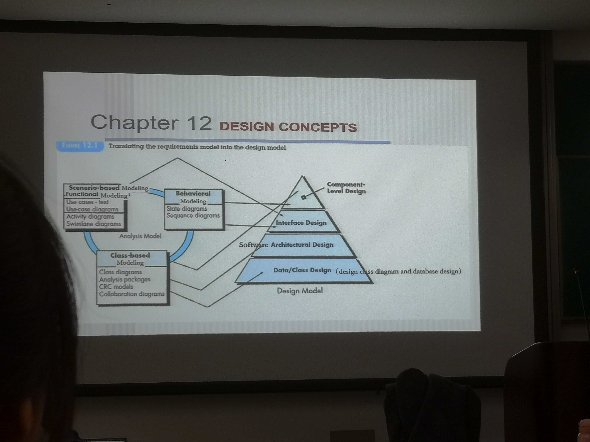

# prototype & spiral
customers **not identify detailed requirements** for
functions and features于是我们通过原型模型把**需求导出**
也是有一些**基本的业务逻辑**功能
他举的例子是云南省的结婚登记系统，甚至没有数据库，但是已经有可以有基本报表、打印结婚证等核心功能。只把界面留下来，其他抛弃掉了

- Communication
- Quick plan
- Modeling Quick design
- Construction of prototype
- Deployment Delivery & feedback
- 又转回去

**迭代**多几轮

- 快速设计、建模，不一定要满足所有需求规约(抛弃了数据库等)
- 根据客户的反馈再进行迭代

**不足**
- 甲方觉得你这么快就能开发出来了
- 算法、工程设计都没有，原型只是东凑西拼的

敏捷模型由此演化

也是**迭代**的

现在要和全国的婚姻登记系统联网，用原型模型就不行了，原型对于其他的婚姻登记系统这些大量**外部**的接口很难导出需求

Big/Risky/Unclear
不同在于要做**风险分析**，因此适合于**高风险的/大的**项目，螺旋模型可以**适用于整个软件生命周期**，不仅限于早期的原型阶段。它可以用于概念开发、新产品开发、产品增强等不同阶段

每次迭代得到一个 work product
CPMCD 可以裁剪
# Scrum & XP

## XP
强调**测试先行**(又说考试要考)，写代码之前，根据详细设计的逻辑把测试用例先写出来，然后才开始写代码，写完了就单元测试了
extreme programming
可以和scrum交叉使用

一个圈就是一个sprint迭代
- planning
  - user stories
    - one user story indicates a **use case**
    - 但不是所有的用例，而是具体的、细化的小的用例
    - **例子**
      - 简单的成绩查询就是一个user story
      - 复杂的成绩查询**里面的**本科生成绩查询、硕士生成绩查询....才是user stories
  - valuse(优先级)
  - acceptance test criteria
    - 这些故事就是甲方做验收测试的依据
  - iteration plan
    - 根据values选择本次迭代要开发的stories
- design
  - simple design CRC cards(class-responsibility-collaborator)
    - 类的属性+方法就是其职责
    - 多个类之间的交互协作
    - 快速地把类设计出来、调用关系、微服务定义
    - 时序图：类的实例化对象之间的消息传递
  - spike solutions prototype
    - **例子**：设计类的某个类要用到机器学习模型，但是这个算法很复杂，把这个单独拿出来开发，作为一个原型去验证
- coding
  - coding之前**要先把测试用例unit test先写好**
  - pair programming
  - refactoring重构，结对编程都写完了，把代码冗余的不规范的修改
  - continuous integration，
    - 对于不同pair写的代码持续集成(慢慢往里面加)，还要通过集成测试来验证
    - 第一次、第二次...的迭代加进来的集成
- test
  - unit test
  - smoke testing，先不管其他的，先集成，冒烟了就是能跑了
  - 每次迭代加上去都能冒烟之后，再有system testing
  - 回归测试，增加新功能/修改bug，看原有的有没有问题
  - universal testing suit，每个类都有其测试套件
  - acceptance testing(甲方做的，看他接受度如何)
- release
  - software increment project velocity computed
  - 本次迭代完成的故事对总故事占比

迭代过程中，发现故事有问题，也不用改，记录到backlog中，下一次迭代再修改，不然本次迭代的进程就出问题了

## scrum
- 人员
  - Product Owner
  - Scrum Master
  - Team
- 开发调研 PST：调研分析，需求条目 -> 故事列表
- 工作量估算 ST：-> 有估算的故事列表
- 发布计划会议 PS：确定会议规划 -> Backlog
- Sprint 计划会议 ST：确定 1-2 优先级故事，挑选承诺完成的条目，分解条目为工作项，评估工作项工时 -> Sprint Backlog
- Sprint 每日站会 ST：昨天完成什么，今天要做什么，有什么问题
- Sprint ST：经过测试的、可运行的、有完整用户文档的 -> 潜在的可交付的产品增量
- Sprint 评审会议 PST：收集意见，下一个 Sprint 准备
- Sprint 回顾会议 PST：优点以及不足 -> 更好的 Scrum 流程

# Domain Analysis
提取公共类、公共 pattern 对于特定的 domain 构建业务类库，供之后的复用，是 umbrella activity
例如类的属性定义、方法的定义、参数的定义标准化
例如我们要做一个农场管理系统，首先学习领域知识
- 从之前的有关农场的**技术文档**和**项目**中学习
- 调研用户**需求**，并且做好将来的需求调研
- 参考**专家建议**
进行领域建模
- 根据需求规约的文字描述，找出可能的潜在类
- 看有没有通用的业务类，定义标准方法和属性
- 进行类的功能建模，构建活动图/泳道图，反应类的逻辑功能，例如
- 确定领域建模语言，UML

# Design Pyramid

- component design
  - state diagram 进一步确认有没有遗漏 类内的方法
  - sequence diagram 进一步确认有没有遗漏 类之间的方法
  - class以分析类为基础
- interface design
  - Use Case的场景元素来搭建界面，所以依赖于场景元素里面的场景，外部接口
  - state diagram 类内接口，相互调用
  - sequence diagram 类之间的接口相互调用，甚至是子系统之间相互调用
- software architectural design
  - 通过CRC模型和类图去划分功能相关的子系统，确定协作关系
  - 完善子系统内部的类和方法
  - 通过协作关系确定子系统之间的通信方式，确定接口
- data/class design
  - 类的设计自然需要类图，同时完善协作关系；
  - 包括数据库，数据结构，类设计，数据字典等
  - 数据库设计以分析类图为依据，一对一多对多等关系构建ER图进而建库
  - 数据结构设计也要参考类设计

# Requirement Engineering
需求工程包括2个规约，四个建模。
- 需求规约中依据 user story 构建用例图，得到需求规约
- 需求分析规约中进行后续三种建模
  - 数据建模，通过提取实体类和类之间的协作关系绘制出分析类图
  - 行为建模，提取事件，绘制每个类的状态图，导出类图中的方法
  - 功能建模，依照用例图中的每个用例的所有事件流（包括异常流）绘制出相应泳道图（对用例功能的抽象），进一步确定类图中的方法
  - 对每个用例中的正常流和异常流绘制时序图，进一步细化

# Requirement 交融三个圈圈
后面的以前面的为依据，是对前面的完善细化
前面多做了后面就少做
相互交叉

# ACD
系统谁来用
上游系统用这个
这个用下游系统
同级系统协作相互调用

# Web App
- content 内容建模要找到内容对象， 可能是⽂本，图⽚，video,声⾳,log。这些对象可能有树状的关系，按⼀下就到⼀
个界⾯，然后到另⼀个界⾯，最后到叶⼦，最开始是root，最下层就是leaf。对象是嵌套的。
- navigation 内容对象放在⼀起，形成⼀个内容对象流，就是导航建模，完成⼀个特定的功能。
- interaction 交互建模，⾸先要找到内容对象，不同的内容对象之间通过交互，完成特定功能。交互建模借⽤时序图， 每个时序图的⽣命线不是对象了，可以理解为界⾯层，
- functional 功能建模，要实现功能的逻辑是什么，例如退货，首先要找到订单，如果订单没有过期就可以退，⾸先要通过退货的活动图，把退货功能的流程图画出来，然后找到退货功能要涉及到哪些内容对象的交互。活动图⼜⽤到了。
- configuration 环境

# Activities actions tasks
- activity主要实现宽泛的目标，与应⽤领域，项目大小，结果复杂性或者实施软件工程的重要程度没有直接关系
- action包含了主要工作产品生产过程中的⼀系列任务
- task关注小而明确的目标，能够生产实际的产品

coding
- 分析理解详细设计（详细的设计规约，理解接口）；
- 算法以及数据结构；
- 准备环境写代码
- (单元测试)自我测试self-testing（可能考虑的：算法复杂度时间性能）；
- SQA软件质量保证；
- refactor重构（测试后对大项目可能要重构，规范性的）
- code review；
    - task1: 准备工作，人员有谁，谁负责
    - task2: 预评审阶段，发代码给别人先看
    - task3: 举行评审会
    - task4：修改代码
- code end(里程碑任务milestone)

# Relationship among classes
- 组合关系：游戏角色的头和手，如果头没了那么手也要消失
- 聚合关系：游戏组队，玩家属于一个队伍，这个队伍没了，玩家并不会消失
- 继承关系：学生可以泛化为本科生、硕士生、博士生
- 关联关系：一对多，多对一，多对多，一个学生可以有多个老师，一个老师也可以有多个学生；一个学生只能有一个导师，一个导师有多个学生
- 依赖关系：要过河这个方法，此时要依赖于船，实际上是一种弱关联关系